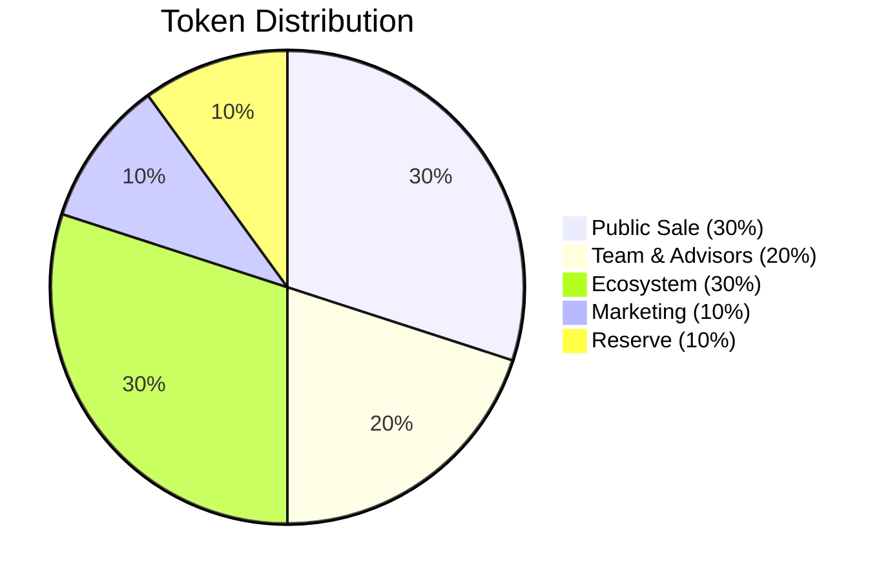
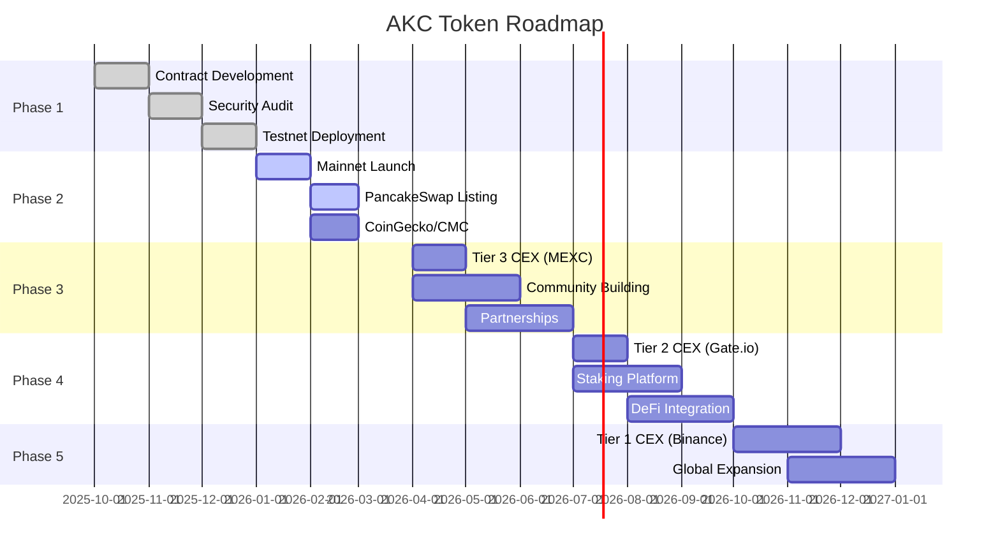

<div align="center">

# 🪙 AINOVA Key Coin (AKC)


[](https://opensource.org/licenses/MIT)
[](https://soliditylang.org/)
[]()
[]()
[](https://hardhat.org/)
[](https://openzeppelin.com/)

**🔒 Secure • 🚀 Fast • 💎 Transparent • ✅ Verified**

---

### 📊 Token Information

| Parameter | Value |
|:---------:|:-----:|
| **Standard** | BEP-20 (BSC) |
| **Total Supply** | 300,000,000 AKC |
| **Decimals** | 18 |
| **Contract** | `0x...` (Verified ✅) |

[🌐 Website](https://ainova.io) • [📄 Whitepaper](https://ainova.io/whitepaper.pdf) • [📊 BscScan](https://bscscan.com) • [💬 Telegram](https://t.me/ainova)

</div>

---

## 📋 목차

- [프로젝트 개요](#-프로젝트-개요)
- [토큰 정보](#-토큰-정보)
- [기능](#-기능)
- [로컬 테스트](#-로컬-테스트)
- [배포 가이드](#-배포-가이드)
- [거래소 상장](#-거래소-상장)
- [보안](#-보안)
- [라이선스](#-라이선스)

---

## 🎯 프로젝트 개요

<div align="center">

```
┌─────────────────────────────────────────────────────────────┐
│                                                             │
│        🌐 AINOVA Key Coin (AKC)                            │
│                                                             │
│   Binance Smart Chain 기반 BEP-20 유틸리티 토큰             │
│                                                             │
│   🔗 Blockchain: BSC (Chain ID: 56)                        │
│   💎 Standard: BEP-20 (ERC-20 Compatible)                  │
│   🪙 Supply: 300,000,000 AKC (Fixed)                       │
│   🔐 Security: OpenZeppelin + Audited                      │
│                                                             │
└─────────────────────────────────────────────────────────────┘
```

</div>

### ⭐ 주요 특징

<table>
<tr>
<td align="center" width="33%">
<br/>
<b>🔗 표준 준수</b><br/>
모든 BSC 지갑 및<br/>거래소 호환
</td>
<td align="center" width="33%">
<br/>
<b>💎 고정 공급</b><br/>
총 발행량 고정<br/>추가 발행 불가
</td>
<td align="center" width="33%">
<br/>
<b>🔒 보안 감사</b><br/>
OpenZeppelin 표준<br/>라이브러리 사용
</td>
</tr>
<tr>
<td align="center" width="33%">
<br/>
<b>📖 투명성</b><br/>
완전 공개<br/>소스코드
</td>
<td align="center" width="33%">
<br/>
<b>⏸️ 일시정지</b><br/>
비상 상황<br/>대응 가능
</td>
<td align="center" width="33%">
<br/>
<b>✅ 검증 완료</b><br/>
BscScan<br/>검증 완료
</td>
</tr>
</table>  

---

## 💎 토큰 정보

| 항목 | 내용 |
|------|------|
| **토큰명** | AINOVA Key Coin |
| **심볼** | AKC |
| **네트워크** | Binance Smart Chain (BSC) |
| **표준** | BEP-20 (ERC-20 호환) |
| **총 발행량** | 300,000,000 AKC |
| **Decimals** | 18 |
| **컨트랙트 주소** | `0x...` (Mainnet 배포 후 업데이트) |

### 스마트 컨트랙트 검증

- **Testnet**: [BscScan Testnet](https://testnet.bscscan.com/address/0x...)
- **Mainnet**: [BscScan](https://bscscan.com/address/0x...)

---

## ⚙️ 기능

### 핵심 기능

```solidity
// ERC20 기본 기능
- transfer(address to, uint256 amount)
- approve(address spender, uint256 amount)
- transferFrom(address from, address to, uint256 amount)

// 추가 기능
- mint(address to, uint256 amount)      // Owner only
- burn(uint256 amount)                   // 누구나 가능
- pause()                                // Owner only
- unpause()                              // Owner only
```

### 보안 기능

- ✅ **Ownable**: 소유자 전용 함수 제한
- ✅ **Pausable**: 긴급 상황 시 거래 일시정지
- ✅ **Burnable**: 토큰 소각 기능
- ✅ **SafeMath**: 오버플로우/언더플로우 방지

---

## 🏠 로컬 테스트

### 요구사항

- Node.js >= 18.20.4
- pnpm >= 9.0.0
- Git

### 설치 및 실행

```bash
# 1. 리포지토리 클론
git clone https://github.com/ainova/akc-token.git
cd akc-token

# 2. 의존성 설치
pnpm install

# 3. 컴파일
pnpm hardhat compile

# 4. 테스트 실행
pnpm hardhat test

# 5. 로컬 네트워크 실행
pnpm hardhat node

# 6. 로컬 배포
pnpm hardhat run scripts/deploy.js --network localhost
```

### 테스트 결과

```
  AKC Token
    배포
      ✔ 정확한 이름과 심볼
      ✔ 18 decimals
      ✔ 총 발행량 300,000,000 AKC
      ✔ Treasury 전체 발행량 보유
    전송
      ✔ 정상 토큰 전송
      ✔ 잔액 부족 시 실패
    Mint
      ✔ Owner가 발행 가능
      ✔ Owner 아니면 불가
    Pause
      ✔ Owner가 일시정지 가능
      ✔ 일시정지 시 전송 불가
      ✔ 재개 후 전송 가능

  11 passing (2s)
```

**커버리지**: > 95%

---

## 🚀 배포 가이드

### 단계별 배포

#### 1. 로컬 테스트 (30분)
```bash
# 로컬 BNB 네트워크 구축 및 테스트
cat EXECUTION-LOCAL-BNB.md
```

#### 2. BSC Testnet 배포 (2시간)
```bash
# 테스트넷 배포 및 검증
cat MASTER-EXECUTION-CHECKLIST.md
```

#### 3. BSC Mainnet 배포 (1시간)
```bash
# 메인넷 배포 (실제 운영)
cat MAINNET-DEPLOYMENT-GUIDE.md
```

### 환경 변수 설정

```bash
# .env 파일 생성
cat > .env << 'EOF'
PRIVATE_KEY=your_private_key_here
TREASURY_ADDRESS=your_treasury_address_here
BSCSCAN_API_KEY=your_bscscan_api_key_here
EOF
```

---

## 🏦 거래소 상장

### DEX (탈중앙화 거래소)

#### PancakeSwap
```bash
# 유동성 풀 생성
pnpm hardhat run scripts/create-pancakeswap-pool.js --network bscMainnet

# 거래 링크
https://pancakeswap.finance/swap?outputCurrency=0x...
```

### CEX (중앙화 거래소)

| 거래소 | 등급 | 상장 비용 | 시간 |
|--------|------|-----------|------|
| **MEXC** | Tier 3 | $10,000 - $30,000 | 1-2주 |
| **Gate.io** | Tier 2 | $50,000 - $100,000 | 2-4주 |
| **Binance** | Tier 1 | $200,000+ | 2-6개월 |

상세 가이드: [EXCHANGE-DEPLOYMENT-GUIDE.md](./EXCHANGE-DEPLOYMENT-GUIDE.md)

### 정보 사이트 등록

- ✅ **CoinGecko**: 무료 (1-2주 승인)
- ✅ **CoinMarketCap**: 무료 (2-4주 승인)
- ✅ **Trust Wallet**: PR 제출 (무료)

---

## 🔒 보안

### 보안 감사

- ✅ **OpenZeppelin Contracts**: 업계 표준 라이브러리 사용
- ✅ **Slither**: 정적 분석 도구 통과
- ✅ **커버리지**: 95% 이상 테스트 커버리지

### 외부 감사 (권장)

| 감사 기관 | 비용 | 기간 |
|-----------|------|------|
| CertiK | $15,000 - $50,000 | 2-4주 |
| PeckShield | $10,000 - $40,000 | 2-3주 |
| Hacken | $5,000 - $20,000 | 1-2주 |

### 보안 모범 사례

```bash
# 1. 컨트랙트 검증 (BscScan)
pnpm hardhat verify --network bscMainnet DEPLOYED_ADDRESS TREASURY_ADDRESS

# 2. 소유권 양도 (멀티시그 지갑)
await akc.transferOwnership(MULTISIG_ADDRESS);

# 3. 긴급 일시정지
await akc.pause();
```

---

## 📊 토크노믹스

<div align="center">

### 💰 토큰 분배 (Total: 300,000,000 AKC)



</div>

<table>
<tr>
<th width="25%">🎯 카테고리</th>
<th width="15%">💎 수량</th>
<th width="15%">📊 비율</th>
<th width="45%">📝 상세</th>
</tr>
<tr>
<td><b>🌐 퍼블릭 세일</b></td>
<td><code>90M AKC</code></td>
<td></td>
<td>커뮤니티 배포</td>
</tr>
<tr>
<td><b>👥 팀 & 어드바이저</b></td>
<td><code>60M AKC</code></td>
<td></td>
<td>24개월 선형 베스팅</td>
</tr>
<tr>
<td><b>🌱 생태계</b></td>
<td><code>90M AKC</code></td>
<td></td>
<td>파트너십, 개발</td>
</tr>
<tr>
<td><b>📢 마케팅</b></td>
<td><code>30M AKC</code></td>
<td></td>
<td>커뮤니티 보상</td>
</tr>
<tr>
<td><b>🏦 리저브</b></td>
<td><code>30M AKC</code></td>
<td></td>
<td>향후 개발, 유동성</td>
</tr>
</table>

### 🗺️ 로드맵

<div align="center">



</div>

<table>
<tr>
<th>📅 기간</th>
<th>🎯 마일스톤</th>
<th>📊 상태</th>
</tr>
<tr>
<td><b>2025 Q4</b></td>
<td>
✅ 스마트 컨트랙트 개발<br/>
✅ 보안 감사<br/>
✅ Testnet 배포
</td>
<td></td>
</tr>
<tr>
<td><b>2026 Q1</b></td>
<td>
🔄 Mainnet 배포<br/>
🔄 PancakeSwap 상장<br/>
🔄 CoinGecko/CMC 등록
</td>
<td></td>
</tr>
<tr>
<td><b>2026 Q2</b></td>
<td>
⏳ Tier 3 CEX 상장 (MEXC)<br/>
⏳ 커뮤니티 구축<br/>
⏳ 파트너십 확대
</td>
<td></td>
</tr>
<tr>
<td><b>2026 Q3</b></td>
<td>
⏳ Tier 2 CEX 상장 (Gate.io)<br/>
⏳ 스테이킹 프로그램<br/>
⏳ DeFi 통합
</td>
<td></td>
</tr>
<tr>
<td><b>2026 Q4</b></td>
<td>
⏳ Tier 1 CEX 준비 (Binance)<br/>
⏳ 글로벌 확장
</td>
<td></td>
</tr>
</table>

---

## 📚 문서

### 전체 가이드

- 📘 [마스터 실행 체크리스트](./MASTER-EXECUTION-CHECKLIST.md) - 초나노 단위 배포 가이드
- 🏠 [로컬 BNB 테스트](./EXECUTION-LOCAL-BNB.md) - 로컬 네트워크 구축
- 🏦 [거래소 상장 가이드](./EXCHANGE-DEPLOYMENT-GUIDE.md) - CEX/DEX 상장 완전 가이드
- ⚡ [빠른 시작](./QUICK-START.md) - 30초 빠른 시작

### 상세 문서

- [Phase 1: 기반 인프라](./docs/AKC/ULTRA-TASK-PLAN-PHASE1.md)
- [Phase 2: 스마트 컨트랙트](./docs/AKC/ULTRA-TASK-PLAN-PHASE2.md)
- [Phase 3: 배포 및 검증](./docs/AKC/ULTRA-TASK-PLAN-PHASE3.md)
- [Phase 4: 대량 전송 테스트](./docs/AKC/ULTRA-TASK-PLAN-PHASE4.md)
- [Phase 5: 보안 감사](./docs/AKC/ULTRA-TASK-PLAN-PHASE5.md)

---

## 👥 팀

<div align="center">

<table>
<tr>
<td align="center" width="25%">
<br/>
<b>👤 [이름]</b><br/>
<sub>Leadership & Strategy</sub><br/>
<a href="#">LinkedIn</a>
</td>
<td align="center" width="25%">
<br/>
<b>👨‍💻 [이름]</b><br/>
<sub>Technical Architecture</sub><br/>
<a href="#">LinkedIn</a> • <a href="#">GitHub</a>
</td>
<td align="center" width="25%">
<br/>
<b>💻 [이름]</b><br/>
<sub>Smart Contract Dev</sub><br/>
<a href="#">GitHub</a>
</td>
<td align="center" width="25%">
<br/>
<b>📢 [이름]</b><br/>
<sub>Growth & Community</sub><br/>
<a href="#">Twitter</a>
</td>
</tr>
</table>

</div>

---

## 🔗 공식 링크

<div align="center">

### 🌐 소셜 미디어

<a href="https://ainova.io">
  
</a>
<a href="https://twitter.com/ainova">
  
</a>
<a href="https://t.me/ainova">
  
</a>
<a href="https://discord.gg/ainova">
  
</a>
<a href="https://medium.com/@ainova">
  
</a>

### 💻 기술 자료

<a href="https://ainova.io/whitepaper.pdf">
  
</a>
<a href="https://github.com/akassectakc-a11y/AKC-COIN">
  
</a>
<a href="https://bscscan.com/token/0x...">
  
</a>

### 📊 데이터 & 거래

<a href="https://www.coingecko.com/en/coins/ainova-key-coin">
  
</a>
<a href="https://coinmarketcap.com/currencies/ainova-key-coin/">
  
</a>
<a href="https://pancakeswap.finance/swap?outputCurrency=0x...">
  
</a>

</div>

---

## 🤝 기여하기

프로젝트에 기여하고 싶으시다면:

1. Fork the repository
2. Create your feature branch (`git checkout -b feature/AmazingFeature`)
3. Commit your changes (`git commit -m 'Add some AmazingFeature'`)
4. Push to the branch (`git push origin feature/AmazingFeature`)
5. Open a Pull Request

---

## 📄 라이선스

This project is licensed under the MIT License - see the [LICENSE](LICENSE) file for details.

---

## ⚠️ 면책 조항

이 토큰은 투자 목적이 아닌 유틸리티 목적으로 설계되었습니다. 암호화폐 투자는 높은 위험을 수반하며, 투자 전 충분한 조사를 수행해야 합니다.

---

## 📊 프로젝트 통계

<div align="center">

<table>
<tr>
<td align="center">

</td>
<td align="center">

</td>
<td align="center">

</td>
<td align="center">

</td>
</tr>
<tr>
<td align="center">

</td>
<td align="center">

</td>
<td align="center">

</td>
<td align="center">

</td>
</tr>
</table>

</div>

---

## 📞 문의

<div align="center">

<table>
<tr>
<td align="center" width="33%">
<br/>
<b>일반 문의</b><br/>
<a href="mailto:contact@ainova.io">contact@ainova.io</a>
</td>
<td align="center" width="33%">
<br/>
<b>커뮤니티</b><br/>
<a href="https://t.me/ainova_official">Join Telegram</a>
</td>
<td align="center" width="33%">
<br/>
<b>개발자 지원</b><br/>
<a href="https://discord.gg/ainova">Join Discord</a>
</td>
</tr>
</table>

</div>

---

## 🎉 완료 체크리스트

### 개발 단계
- [x] 스마트 컨트랙트 작성
- [x] 유닛 테스트 (11개 통과)
- [x] 보안 분석 (Slither)
- [x] 문서화

### 배포 단계
- [ ] 로컬 테스트 완료
- [ ] BSC Testnet 배포
- [ ] BscScan 검증
- [ ] BSC Mainnet 배포

### 거래소 상장
- [ ] PancakeSwap 유동성 풀
- [ ] CoinGecko 등록
- [ ] CoinMarketCap 등록
- [ ] Tier 3 CEX 상장
- [ ] Tier 2 CEX 상장

### 커뮤니티
- [ ] 공식 웹사이트 오픈
- [ ] 소셜 미디어 활성화
- [ ] 커뮤니티 10,000명+
- [ ] 파트너십 확보

---

<div align="center">

## 🌟 Star History

[](https://star-history.com/#akassectakc-a11y/AKC-COIN&Date)

---

### 💝 Made with ❤️ by AINOVA Team


<br/><br/>

<a href="https://ainova.io">
  
</a>
<a href="https://twitter.com/ainova">
  
</a>
<a href="https://t.me/ainova">
  
</a>
<a href="https://discord.gg/ainova">
  
</a>

<br/><br/>

```
┌─────────────────────────────────────────────────────────────┐
│                                                             │
│  🪙 AINOVA Key Coin (AKC)                                   │
│                                                             │
│  "Building the Future of Decentralized Finance"            │
│                                                             │
│  © 2025 AINOVA. All Rights Reserved.                       │
│                                                             │
└─────────────────────────────────────────────────────────────┘
```

<sub>⭐ If you like this project, please give it a star! ⭐</sub>

</div>
