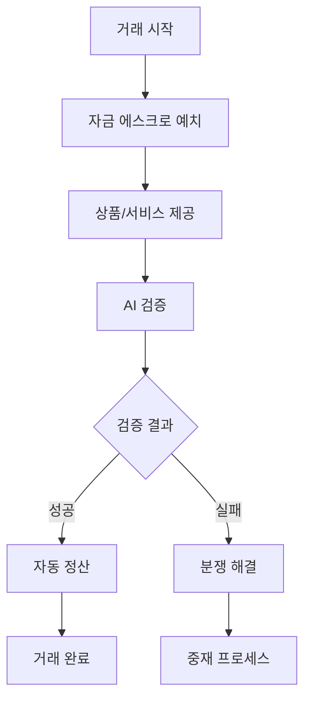

# 1.4 AKC의 해결 방안 (AKC Solutions)

## 1.4.1 AI 기반 사기 방지 시스템

### 실시간 위험 탐지 엔진

#### 핵심 기술
1. **머신러닝 모델**
   - **Random Forest:** 다변수 위험 요소 분석
   - **Neural Network:** 복잡한 패턴 인식
   - **Anomaly Detection:** 이상 행동 실시간 탐지

2. **데이터 분석 요소**
   - **거래 패턴 분석:** 시간, 빈도, 금액 패턴
   - **지갑 행동 분석:** 과거 거래 이력, 네트워크 활동
   - **상호작용 분석:** 거래 상대방과의 관계 분석

#### 위험 점수 산정 시스템
```
위험 점수 = (거래 이력 × 0.3) + (지갑 연령 × 0.2) + 
           (거래 패턴 × 0.25) + (네트워크 신뢰도 × 0.25)
```

### 사전 예방 메커니즘

#### 3단계 보안 검증
1. **1차 검증: 기본 신뢰도 평가**
   - 지갑 주소 기본 정보 확인
   - 과거 거래 이력 분석
   - 블랙리스트 대조 확인

2. **2차 검증: 심화 패턴 분석**
   - AI 모델을 통한 행동 패턴 분석
   - 유사 사기 사례와의 비교 분석
   - 실시간 네트워크 활동 모니터링

3. **3차 검증: 종합 위험 평가**
   - 모든 데이터 종합 분석
   - 최종 위험 점수 산정
   - 거래 승인/보류/거부 결정

## 1.4.2 스마트 에스크로 시스템

### 자동화된 안전 결제

#### 에스크로 작동 원리


#### 스마트 컨트랙트 기능
1. **자동 예치 관리**
   - 거래 시작 시 자동 자금 잠금
   - 조건 충족 시 자동 해제
   - 분쟁 시 자금 보호

2. **조건부 실행**
   - 사전 정의된 조건 확인
   - 다중 서명 요구사항
   - 시간 기반 자동 실행

3. **투명한 기록 관리**
   - 모든 거래 과정 블록체인 기록
   - 변경 불가능한 거래 이력
   - 실시간 상태 추적

### 분쟁 해결 메커니즘

#### AI 기반 자동 중재
1. **증거 수집 및 분석**
   - 거래 관련 모든 데이터 수집
   - 커뮤니케이션 기록 분석
   - 배송 추적 정보 확인

2. **패턴 매칭**
   - 유사 분쟁 사례와 비교
   - 성공적 해결 사례 참조
   - 최적 해결 방안 제시

3. **자동 보상 처리**
   - 분쟁 유형별 표준 보상
   - 피해 규모에 따른 차등 보상
   - 신속한 보상 지급

## 1.4.3 혁신적 수수료 구조

### 위험 기반 차등 수수료

#### 수수료 산정 공식
```
최종 수수료 = 기본 수수료 × (1 - 신뢰도 할인) × 거래량 할인
```

#### 수수료 구조표
| 위험 등급 | 신뢰도 점수 | 수수료율 | 기존 대비 절감 |
|-----------|-------------|----------|----------------|
| 매우 안전 | 90-100점 | 0.1% | 90% 절감 |
| 안전 | 80-89점 | 0.15% | 85% 절감 |
| 보통 | 70-79점 | 0.2% | 80% 절감 |
| 주의 | 60-69점 | 0.25% | 75% 절감 |
| 위험 | 60점 미만 | 거래 제한 | - |

### 투명한 수수료 정책

#### 수수료 구성 요소
1. **네트워크 수수료 (40%)**
   - 블록체인 트랜잭션 비용
   - 가스비 최적화를 통한 절감

2. **AI 분석 비용 (30%)**
   - 위험 분석 연산 비용
   - 모델 학습 및 업데이트 비용

3. **에스크로 관리 비용 (20%)**
   - 스마트 컨트랙트 실행 비용
   - 자금 보관 및 관리 비용

4. **운영 및 개발 비용 (10%)**
   - 플랫폼 유지보수
   - 새로운 기능 개발

## 1.4.4 글로벌 접근성 확보

### 다중 체인 지원

#### 지원 예정 블록체인
1. **1차 지원 (2026년)**
   - Binance Smart Chain (BSC)
   - Ethereum
   - Polygon

2. **2차 지원 (2027년)**
   - Solana
   - Avalanche
   - Arbitrum

3. **3차 지원 (2028년)**
   - Cardano
   - Polkadot
   - Cosmos

### 다국어 및 다통화 지원

#### 언어 지원 계획
- **1차:** 한국어, 영어, 중국어, 일본어
- **2차:** 스페인어, 프랑스어, 독일어, 러시아어
- **3차:** 아랍어, 힌디어, 포르투갈어, 베트남어

#### 법정화폐 연동
- **주요 통화:** USD, EUR, JPY, KRW, CNY
- **신흥국 통화:** INR, BRL, MXN, IDR
- **스테이블코인:** USDT, USDC, BUSD, DAI

## 1.4.5 사용자 경험 혁신

### 원클릭 결제 시스템

#### 간소화된 거래 과정
1. **거래 요청:** 상품/서비스 선택
2. **AI 분석:** 자동 위험 평가 (1-2초)
3. **에스크로 예치:** 원클릭 결제
4. **거래 완료:** 자동 정산

#### 직관적 인터페이스
- **위험도 시각화:** 색상 기반 위험 표시
- **실시간 상태:** 거래 진행 상황 실시간 업데이트
- **간편 알림:** 푸시 알림을 통한 상태 변경 안내

### 24/7 AI 고객 지원

#### 자동화된 고객 서비스
1. **챗봇 기반 1차 지원**
   - 일반적인 문의 자동 응답
   - 거래 상태 실시간 확인
   - 문제 해결 가이드 제공

2. **AI 분석 기반 2차 지원**
   - 복잡한 기술적 문제 분석
   - 개인화된 해결 방안 제시
   - 전문가 연결 필요 시 자동 라우팅

3. **인간 전문가 3차 지원**
   - 고도의 전문성 요구 사안
   - 법적 분쟁 관련 상담
   - VIP 고객 전담 서비스

## 1.4.6 경쟁 우위 요소

### 기존 솔루션 대비 우위점

| 구분 | 기존 플랫폼 | AKC 솔루션 | 개선 효과 |
|------|-------------|------------|-----------|
| 사기 탐지 | 사후 대응 | AI 사전 예방 | 사기율 90% 감소 |
| 수수료 | 3-5% | 0.1-0.3% | 비용 85% 절감 |
| 처리 시간 | 1-3일 | 실시간 | 속도 100배 향상 |
| 투명성 | 제한적 | 완전 공개 | 신뢰도 향상 |
| 접근성 | 지역 제한 | 글로벌 | 시장 확대 |

### 지속적 혁신 체계

#### 기술 발전 로드맵
1. **AI 모델 고도화**
   - 정확도 지속 개선
   - 새로운 사기 패턴 학습
   - 예측 성능 최적화

2. **블록체인 기술 발전**
   - 확장성 개선
   - 에너지 효율성 향상
   - 상호 운용성 확대

3. **사용자 경험 개선**
   - 인터페이스 최적화
   - 개인화 서비스 강화
   - 접근성 지속 개선

---

**이전:** [1.3 시장 문제점](./1-3-MARKET-PROBLEMS.md)  
**다음:** [2. 시스템 개요](./2-SYSTEM-OVERVIEW.md)  
**상위 목차:** [1. 서론](./1-INTRODUCTION.md)  
**메인 백서:** [AKC 백서 전체](./AKC-WHITEPAPER.md)
