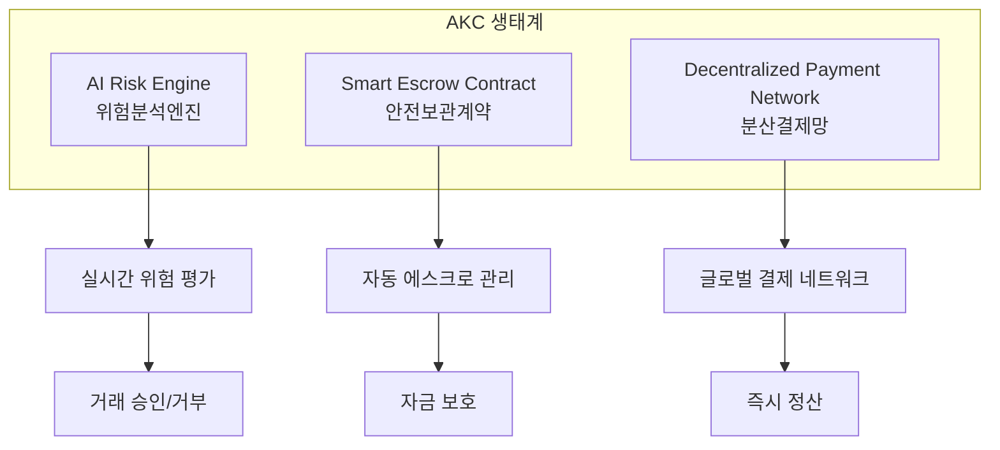
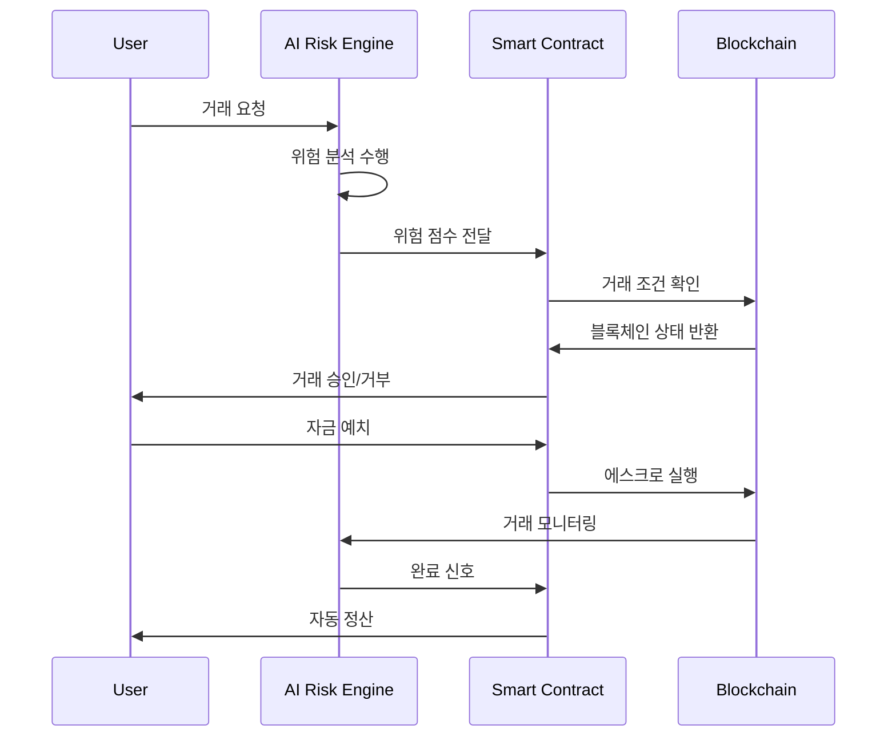

# 2.1 시스템 구조 요약 (System Architecture Summary)

## 2.1.1 AKC 생태계 전체 구조

### 3축 핵심 시스템

#### 1. AI Risk Engine (위험분석엔진)
**역할:** 모든 거래의 위험도를 실시간으로 분석하고 평가

**핵심 기능:**
- **실시간 패턴 분석:** 거래 패턴의 이상 징후 탐지
- **신뢰도 점수 산정:** 0-100점 스케일의 객관적 평가
- **사기 예방:** 의심 거래 사전 차단
- **학습 기능:** 새로운 사기 패턴 지속 학습

**기술 스택:**
- Python + TensorFlow
- Real-time Data Processing
- Machine Learning Models
- Blockchain Data Integration

#### 2. Smart Escrow Contract (안전보관계약)
**역할:** 거래 자금을 안전하게 보관하고 조건부 자동 실행

**핵심 기능:**
- **자동 자금 예치:** 거래 시작 시 자동 잠금
- **조건부 해제:** 거래 완료 조건 충족 시 자동 송금
- **분쟁 관리:** 문제 발생 시 자금 보호
- **투명한 기록:** 모든 과정 블록체인 기록

**기술 스택:**
- Solidity Smart Contracts
- Binance Smart Chain
- Multi-signature Wallets
- Time-locked Transactions

#### 3. Decentralized Payment Network (분산결제망)
**역할:** 글로벌 P2P 결제 인프라 제공

**핵심 기능:**
- **다중 체인 지원:** 여러 블록체인 네트워크 연동
- **크로스체인 브릿지:** 체인 간 자산 이동
- **유동성 풀:** 안정적인 거래 환경 제공
- **수수료 최적화:** 가장 효율적인 경로 선택

**기술 스택:**
- Cross-chain Protocols
- Liquidity Pool Management
- Automated Market Makers
- Gas Optimization

## 2.1.2 시스템 간 상호작용

### 데이터 흐름도

### 보안 계층 구조

#### Layer 1: 네트워크 보안
- **블록체인 합의 메커니즘:** Proof of Stake Authority
- **노드 검증:** 분산된 검증자 네트워크
- **암호화:** 256-bit 암호화 표준

#### Layer 2: 스마트 컨트랙트 보안
- **코드 감사:** 외부 보안 감사 완료
- **다중 서명:** 중요 거래 시 다중 승인 필요
- **업그레이드 가능성:** 프록시 패턴을 통한 안전한 업데이트

#### Layer 3: AI 모델 보안
- **모델 검증:** 정기적인 모델 성능 검증
- **데이터 무결성:** 입력 데이터 검증 시스템
- **편향 방지:** 공정성 알고리즘 적용

#### Layer 4: 사용자 보안
- **개인키 관리:** 하드웨어 지갑 연동 지원
- **2FA 인증:** 이중 인증 시스템
- **생체 인증:** 지문, 얼굴 인식 지원

## 2.1.3 확장성 설계

### 수평적 확장 (Horizontal Scaling)

#### AI 엔진 확장
- **분산 처리:** 여러 AI 노드에서 병렬 처리
- **로드 밸런싱:** 트래픽 분산을 통한 성능 최적화
- **캐싱 시스템:** 자주 사용되는 데이터 캐싱

#### 블록체인 확장
- **샤딩:** 데이터베이스 분할을 통한 처리량 증대
- **레이어 2 솔루션:** 사이드체인 및 상태 채널 활용
- **크로스체인:** 다중 체인 동시 지원

### 수직적 확장 (Vertical Scaling)

#### 성능 최적화
- **알고리즘 개선:** AI 모델 효율성 지속 개선
- **하드웨어 업그레이드:** 고성능 서버 인프라
- **네트워크 최적화:** CDN 및 엣지 컴퓨팅 활용

## 2.1.4 상호 운용성 (Interoperability)

### 기존 시스템과의 연동

#### 전통적 결제 시스템
- **은행 API 연동:** 법정화폐 입출금 지원
- **카드 결제 연동:** 신용카드/체크카드 결제 지원
- **모바일 결제:** Apple Pay, Google Pay 연동

#### 다른 블록체인 프로젝트
- **DeFi 프로토콜:** Uniswap, PancakeSwap 연동
- **NFT 마켓플레이스:** OpenSea, Rarible 연동
- **스테이블코인:** USDT, USDC, BUSD 지원

### API 및 SDK 제공

#### 개발자 도구
- **RESTful API:** 표준 HTTP API 제공
- **GraphQL:** 유연한 데이터 쿼리 지원
- **WebSocket:** 실시간 데이터 스트리밍
- **SDK:** JavaScript, Python, Java SDK 제공

#### 통합 가이드
- **문서화:** 상세한 API 문서 제공
- **샘플 코드:** 다양한 언어별 예제
- **테스트넷:** 개발자 테스트 환경 제공
- **기술 지원:** 개발자 커뮤니티 운영

## 2.1.5 성능 지표 및 모니터링

### 핵심 성능 지표 (KPI)

#### 시스템 성능
| 지표 | 목표값 | 현재값 | 측정 방법 |
|------|--------|--------|-----------|
| 거래 처리 속도 | < 3초 | 개발 중 | 평균 응답 시간 |
| AI 분석 시간 | < 1초 | 개발 중 | 위험 평가 완료 시간 |
| 시스템 가용성 | 99.9% | 개발 중 | 연간 다운타임 |
| 동시 사용자 | 100만명 | 개발 중 | 피크 시간 처리량 |

#### 보안 성능
| 지표 | 목표값 | 현재값 | 측정 방법 |
|------|--------|--------|-----------|
| 사기 탐지율 | > 95% | 개발 중 | 정확도 측정 |
| 거짓 양성률 | < 5% | 개발 중 | 오탐률 측정 |
| 보안 사고 | 0건 | 0건 | 월별 보안 감사 |

### 실시간 모니터링 시스템

#### 대시보드 구성
1. **시스템 상태 모니터링**
   - 서버 리소스 사용률
   - 네트워크 트래픽
   - 데이터베이스 성능

2. **거래 모니터링**
   - 실시간 거래량
   - 평균 거래 금액
   - 지역별 거래 분포

3. **보안 모니터링**
   - 의심 거래 탐지
   - 보안 위협 알림
   - 시스템 침입 시도

#### 알림 시스템
- **즉시 알림:** 심각한 보안 위협 시 즉시 알림
- **일일 리포트:** 일일 시스템 상태 보고서
- **주간 분석:** 주간 성능 및 보안 분석 리포트

---

**다음:** [2.2 동작 시나리오](./2-2-OPERATION-SCENARIOS.md)  
**상위 목차:** [2. 시스템 개요](./2-SYSTEM-OVERVIEW.md)  
**메인 백서:** [AKC 백서 전체](./AKC-WHITEPAPER.md)
