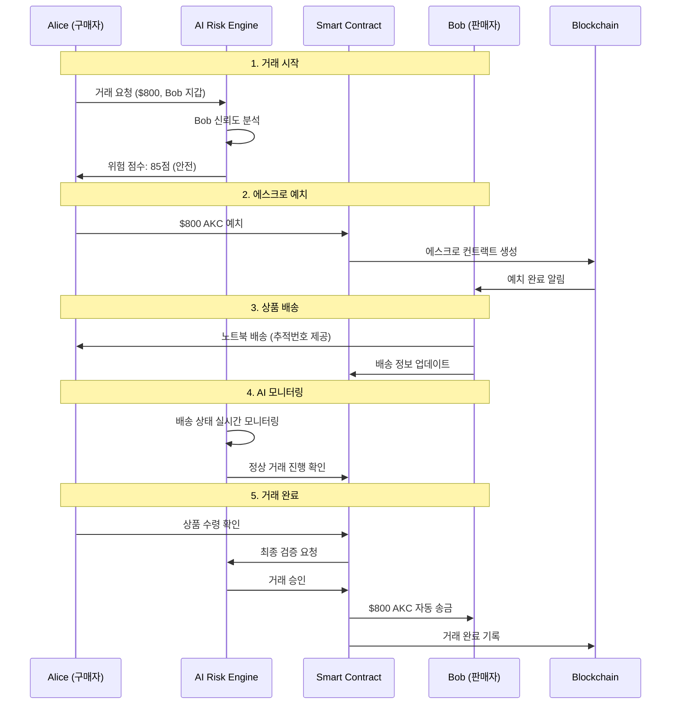
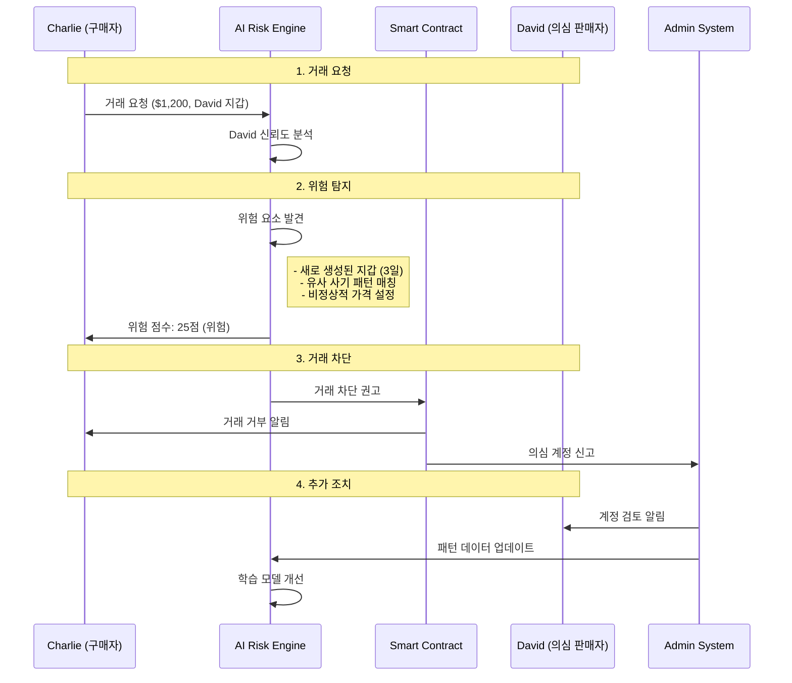
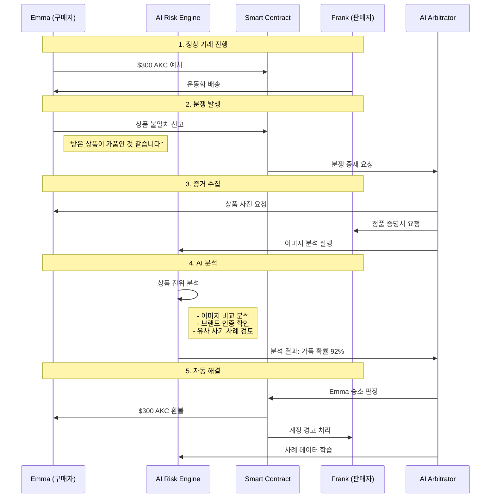
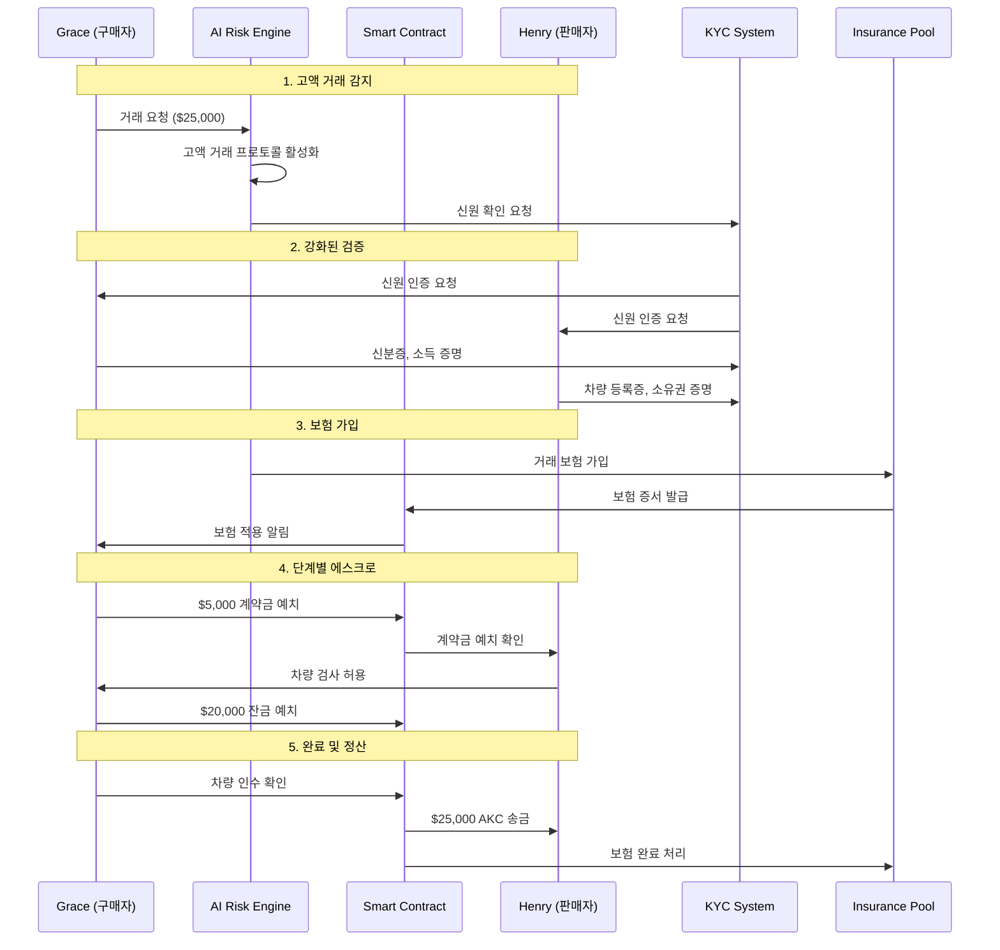
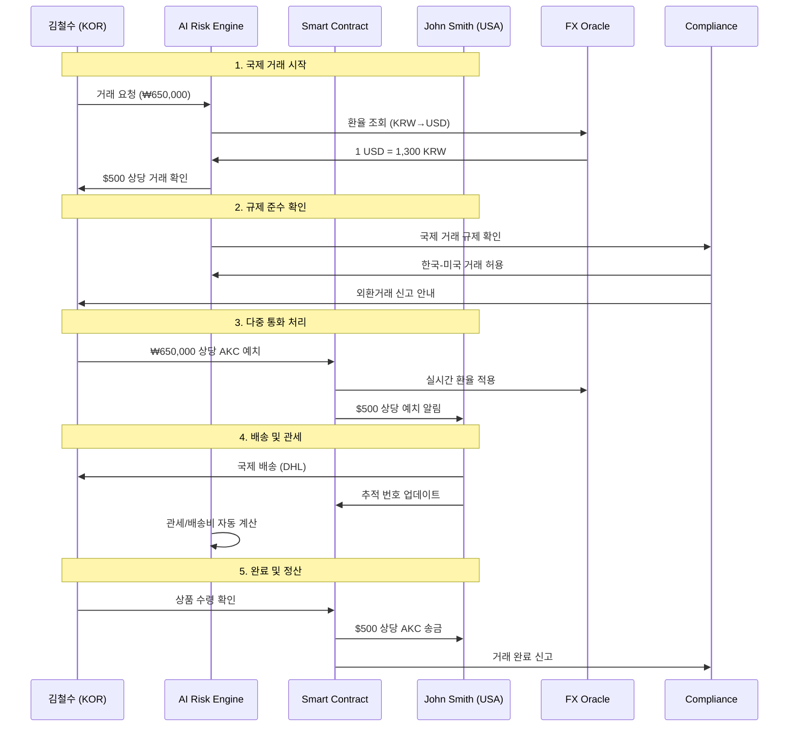

# 2.2 동작 시나리오 (Operation Scenarios)

## 2.2.1 기본 거래 시나리오

### 표준 P2P 거래 과정

#### 시나리오: 중고 노트북 거래
**참여자:** Alice (구매자), Bob (판매자)  
**거래 금액:** $800 (상당 AKC)  
**상품:** MacBook Pro 2021

#### 단계별 상세 설명

**1단계: 거래 요청 및 위험 분석 (0-2초)**
- Alice가 Bob의 노트북 구매 의사 표시
- AI 엔진이 Bob의 지갑 주소 분석
  - 과거 거래 이력: 50건 (성공률 96%)
  - 지갑 연령: 2년 3개월
  - 네트워크 신뢰도: 높음
- 종합 위험 점수: 85점 (안전 등급)

**2단계: 스마트 에스크로 예치 (3-5초)**
- Alice가 $800 상당의 AKC를 에스크로에 예치
- 스마트 컨트랙트가 자금을 안전하게 잠금
- Bob에게 예치 완료 알림 전송

**3단계: 상품 배송 및 추적 (1-3일)**
- Bob이 노트북을 포장하여 배송
- 배송 추적 정보를 시스템에 업데이트
- AI가 배송 상태를 실시간 모니터링

**4단계: 수령 확인 및 검증 (즉시)**
- Alice가 상품 수령 후 만족도 확인
- AI가 거래 전 과정을 종합 분석
- 이상 징후 없음을 확인

**5단계: 자동 정산 (즉시)**
- 스마트 컨트랙트가 Bob에게 자동 송금
- 거래 완료 기록이 블록체인에 영구 저장
- 양측 모두에게 완료 알림 전송

## 2.2.2 위험 거래 시나리오

### 의심 거래 탐지 및 차단

#### 시나리오: 사기 시도 거래
**참여자:** Charlie (구매자), David (의심 판매자)  
**거래 금액:** $1,200 (상당 AKC)  
**상품:** iPhone 14 Pro

#### 위험 요소 분석

**탐지된 위험 신호:**
1. **지갑 연령:** 3일 (신규 계정)
2. **거래 이력:** 0건 (검증 불가)
3. **가격 이상:** 시장가 대비 30% 저렴
4. **패턴 매칭:** 알려진 사기 패턴과 85% 일치
5. **네트워크 분석:** 의심스러운 지갑들과 연결

**AI 판단 근거:**
- 종합 위험 점수: 25점 (임계값 60점 미만)
- 사기 확률: 78%
- 권고 조치: 거래 차단

## 2.2.3 분쟁 해결 시나리오

### 자동 중재 시스템 작동

#### 시나리오: 상품 불일치 분쟁
**참여자:** Emma (구매자), Frank (판매자)  
**거래 금액:** $300 (상당 AKC)  
**상품:** 나이키 운동화 (가품 의심)

#### 분쟁 해결 프로세스

**1단계: 분쟁 접수 (즉시)**
- Emma가 상품 불일치 신고
- 시스템이 자동으로 자금 동결
- 양측에게 분쟁 진행 알림

**2단계: 증거 수집 (24시간 이내)**
- 구매자: 상품 사진, 영수증, 불만 사항
- 판매자: 정품 증명서, 배송 기록, 반박 자료
- 시스템: 거래 기록, 커뮤니케이션 로그

**3단계: AI 분석 (1시간 이내)**
- 이미지 인식을 통한 상품 진위 판별
- 과거 유사 사례와의 패턴 비교
- 양측 제출 자료의 신뢰성 검증

**4단계: 판정 및 실행 (즉시)**
- AI 중재자가 종합 판단
- 자동으로 보상 처리 실행
- 관련 계정에 신뢰도 점수 반영

## 2.2.4 대량 거래 시나리오

### 고액 거래 특별 프로토콜

#### 시나리오: 자동차 거래
**참여자:** Grace (구매자), Henry (판매자)  
**거래 금액:** $25,000 (상당 AKC)  
**상품:** 2020 Tesla Model 3

#### 고액 거래 특별 조치

**강화된 보안 절차:**
1. **신원 확인 (KYC):** 정부 발급 신분증 확인
2. **자산 증명:** 거래 능력 입증 서류
3. **다중 서명:** 3개 이상 서명 필요
4. **보험 가입:** 거래 금액의 110% 보험

**단계별 에스크로:**
- 1단계: 계약금 20% 예치
- 2단계: 상품 검증 후 잔금 80% 예치
- 3단계: 최종 확인 후 일괄 송금

## 2.2.5 국제 거래 시나리오

### 크로스보더 결제 처리

#### 시나리오: 한국-미국 간 거래
**참여자:** 김철수 (한국, 구매자), John Smith (미국, 판매자)  
**거래 금액:** $500 (상당 AKC)  
**상품:** 한정판 스니커즈

#### 국제 거래 특별 고려사항

**환율 처리:**
- 실시간 환율 적용 (Chainlink Oracle 활용)
- 환율 변동 위험 최소화 (±2% 범위 내)
- 다중 통화 지원 (USD, EUR, JPY, KRW 등)

**규제 준수:**
- 각국 외환거래법 준수
- 자동 신고 시스템 연동
- 세금 계산 및 안내

**배송 및 관세:**
- 국제 배송 추적 시스템
- 관세 자동 계산
- 배송 보험 자동 가입

---

**이전:** [2.1 시스템 구조](./2-1-SYSTEM-ARCHITECTURE.md)  
**상위 목차:** [2. 시스템 개요](./2-SYSTEM-OVERVIEW.md)  
**다음:** [3. 기술 구조](./3-TECHNICAL-ARCHITECTURE.md)  
**메인 백서:** [AKC 백서 전체](./AKC-WHITEPAPER.md)
