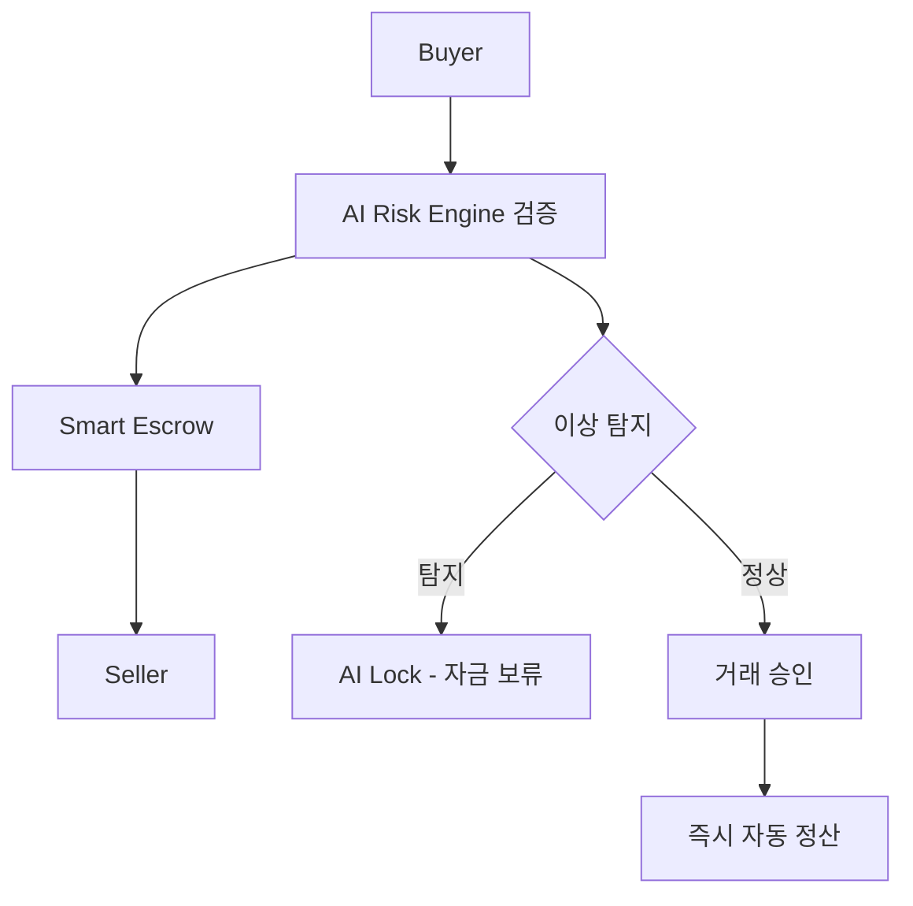

# 5. 안전결제 메커니즘 (Secure Payment Mechanism)

## 5.1 스마트 에스크로 구조
- 양측 자금은 거래 완료 전까지 **중립지갑(Safe Wallet)**에 예치  
- AI가 결제조건 충족 여부를 검증 후 자동 송금  

## 5.2 결제 흐름

**단계별 설명:**
1. **Buyer → AI Risk Engine:** 구매자 거래 요청 및 위험도 분석
2. **AI Risk Engine 검증:** 실시간 사기패턴 탐지 및 신뢰도 평가
3. **Smart Escrow:** 안전 점수 기반 자동 예치 실행
4. **거래 중 모니터링:** AI가 거래 과정 실시간 감시
5. **이상 탐지 시:** 자금 자동 보류 (AI Lock) 및 분쟁 해결 프로세스
6. **거래 승인 시:** 즉시 자동 정산 및 Seller에게 송금

## 5.3 보안 강화 요소
- **AI 기반 사기패턴 탐지:** 실시간 거래 패턴 분석 및 이상행위 탐지
- **다중서명(Multi-Sig) 기반 결제 서명:** 보안성 강화를 위한 다중 승인 시스템
- **거래 로그 AI 감시 (Audit Node):** 모든 거래 기록의 AI 기반 실시간 감사

---

**이전:** [4. AKC 코인 구조](./4-TOKEN-STRUCTURE.md)  
**다음:** [6. AI 위험분석 시스템](./6-AI-RISK-ANALYSIS.md)  
**메인 백서:** [AKC 백서 전체](./AKC-WHITEPAPER.md)
