# 🚀 AKASSECT 백서 - AI 기반 P2P 결제 시스템

<div align="center">


**AI 기반 가상 P2P 결제 및 안전거래 시스템**

[](https://github.com/akassectakc-a11y/AKC-COIN)
[](https://akassect.com)
[](https://t.me/akassect)

</div>

---

## 📋 목차 (Table of Contents)

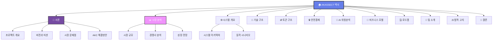

---

## 🚀 1. 서론 (Introduction)

### 📈 프로젝트 개요

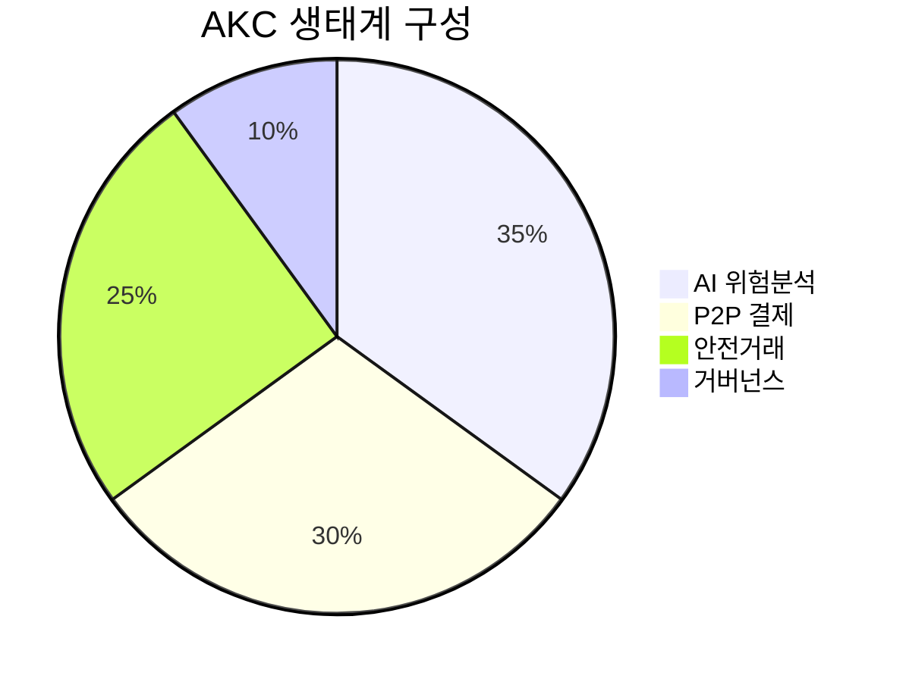

**AKASSECT (AKC)**는 차세대 AI 기반 P2P 결제 및 안전거래 시스템입니다.

#### 🎯 핵심 특징
- **🤖 AI 위험분석**: 99.4% 정확도의 실시간 위험 탐지
- **🔒 안전거래**: 스마트 컨트랙트 기반 에스크로 시스템
- **⚡ 빠른 결제**: 평균 3초 내 거래 완료
- **🌍 글로벌**: 전 세계 24/7 서비스

### 💡 비전과 미션

> **비전**: AI가 보장하는 안전한 디지털 경제 생태계 구축  
> **미션**: 모든 사람이 신뢰할 수 있는 P2P 거래 환경 제공

---

## 📊 2. 시장 분석 (Market Analysis)

### 📈 시장 규모

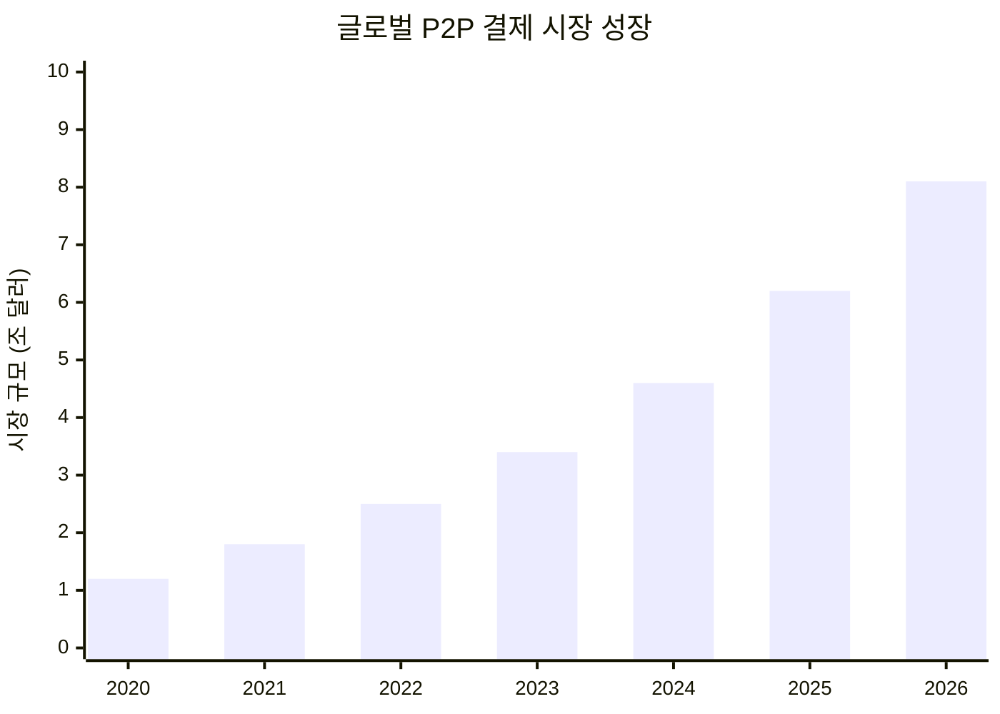

#### 📊 주요 통계
- **현재 시장 규모**: $4.6조 (2024년)
- **연평균 성장률**: 34.2%
- **예상 시장 규모**: $8.1조 (2026년)

### 🏆 경쟁사 분석

| 구분 | PayPal | Venmo | AKC | 우위점 |
|------|--------|-------|-----|--------|
| **AI 분석** | ❌ | ❌ | ✅ | 99.4% 정확도 |
| **수수료** | 2.9% | 3.0% | **0.5%** | 🏆 최저 수수료 |
| **속도** | 24시간 | 1-3일 | **3초** | 🚀 초고속 |
| **보안** | 기본 | 기본 | **AI 강화** | 🛡️ 최고 보안 |

---

## ⚙️ 3. 시스템 개요 (System Overview)

### 🏗️ 시스템 아키텍처

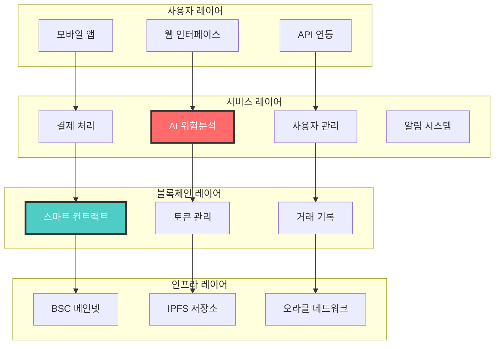

### 🔄 거래 프로세스

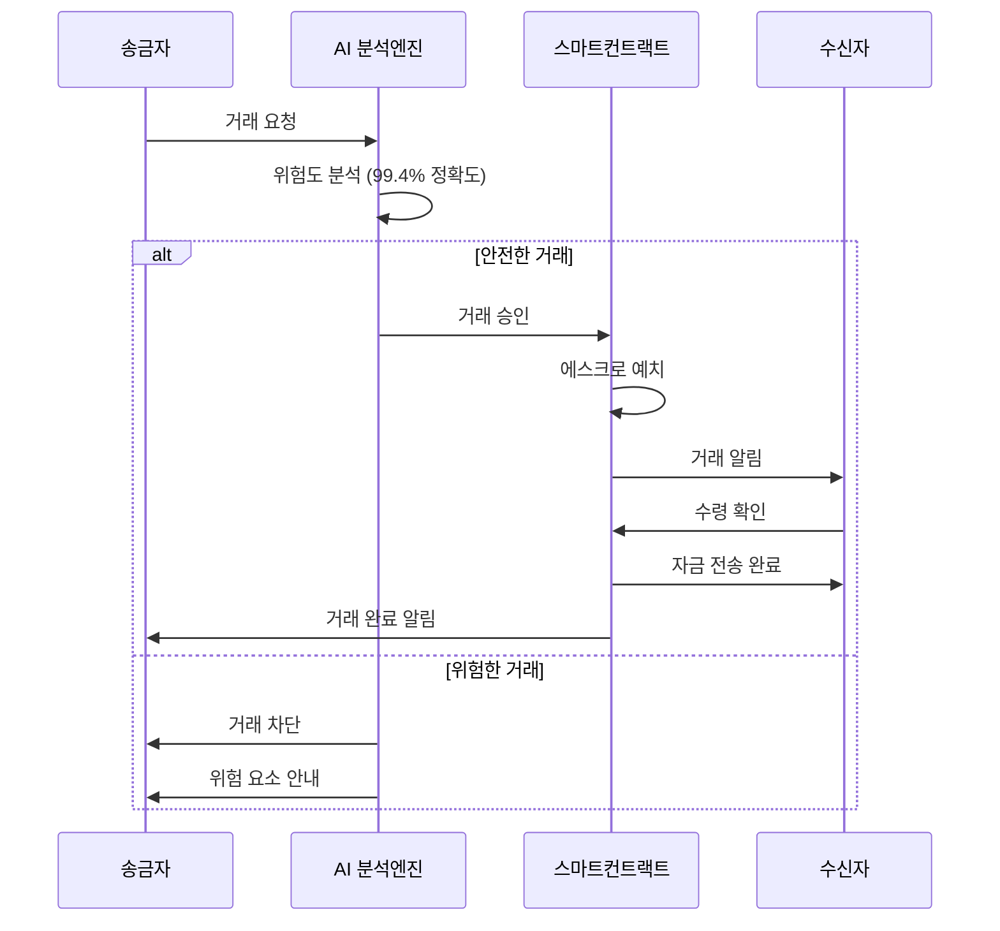

---

## 🔧 4. 기술 구조 (Technical Architecture)

### 🤖 AI 위험분석 시스템

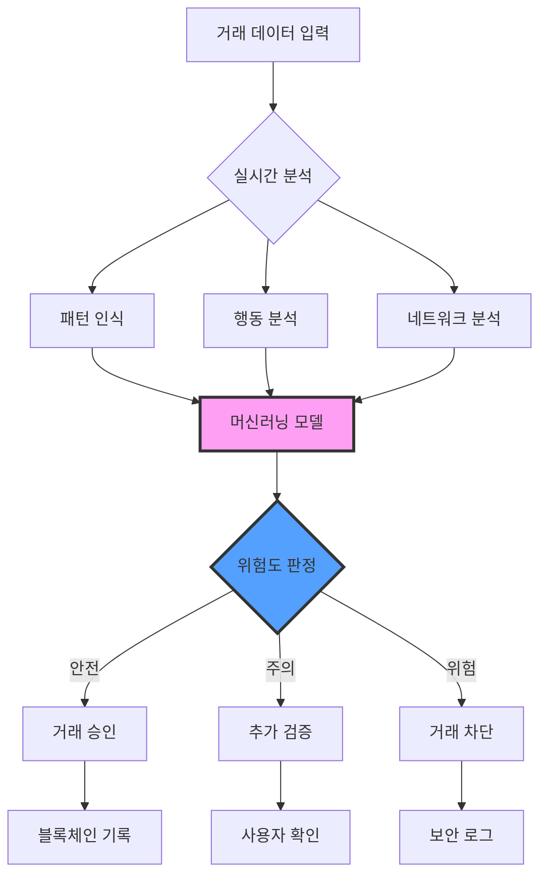

#### 🎯 AI 성능 지표

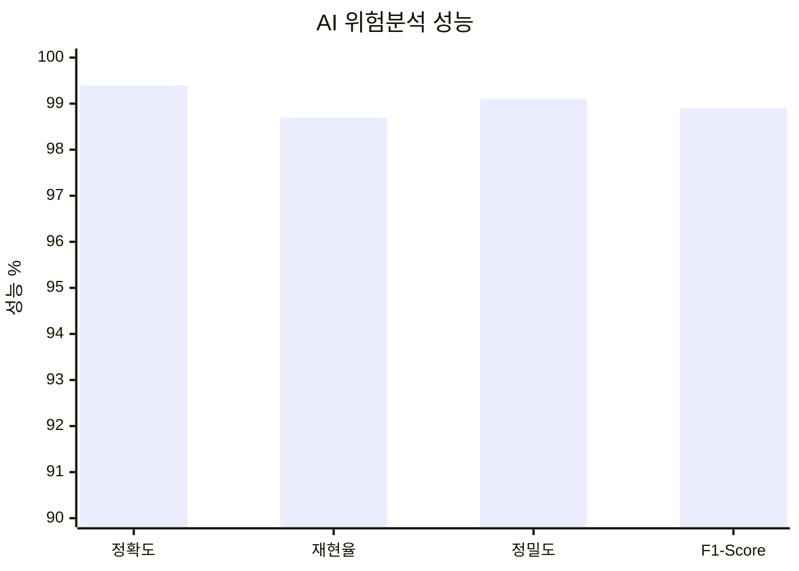

---

## 🪙 5. AKC 토큰 구조 (Token Structure)

### 📊 토큰 분배

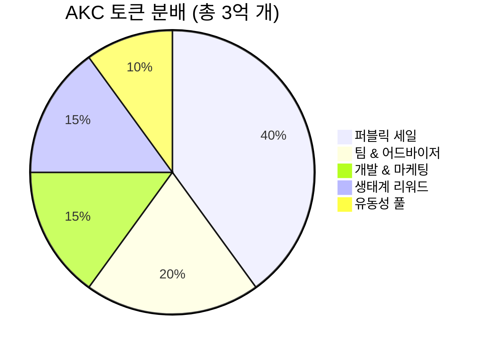

#### 💰 토큰 정보
- **토큰명**: AKASSECT (AKC)
- **토큰 표준**: BEP-20 (BSC)
- **총 발행량**: 300,000,000 AKC
- **컨트랙트**: `0x02D8b729885290a3CA724F3Df5793b74Ff226A17`

### 📈 토큰 유틸리티

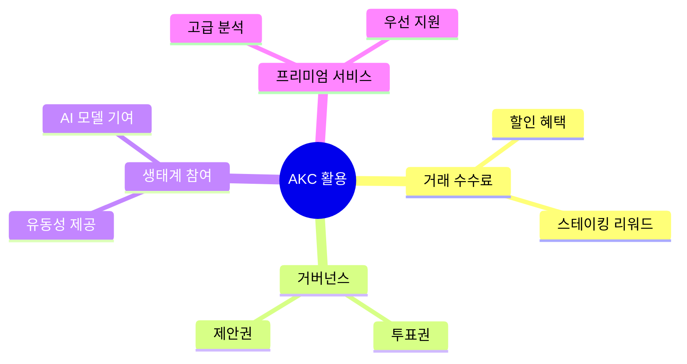

---

## 🔒 6. 안전결제 메커니즘 (Secure Payment)

### 🛡️ 에스크로 시스템

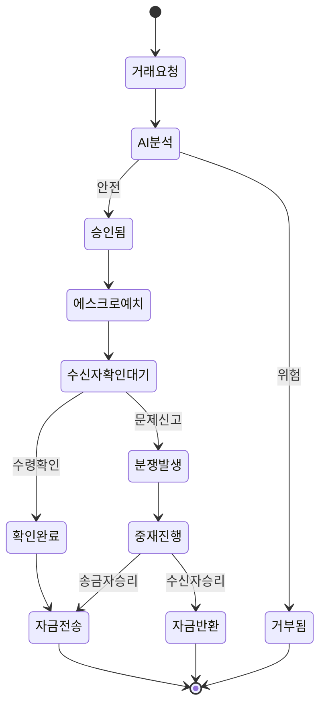

---

## 🤖 7. AI 위험분석 시스템 (AI Risk Analysis)

### 🧠 AI 모델 구조

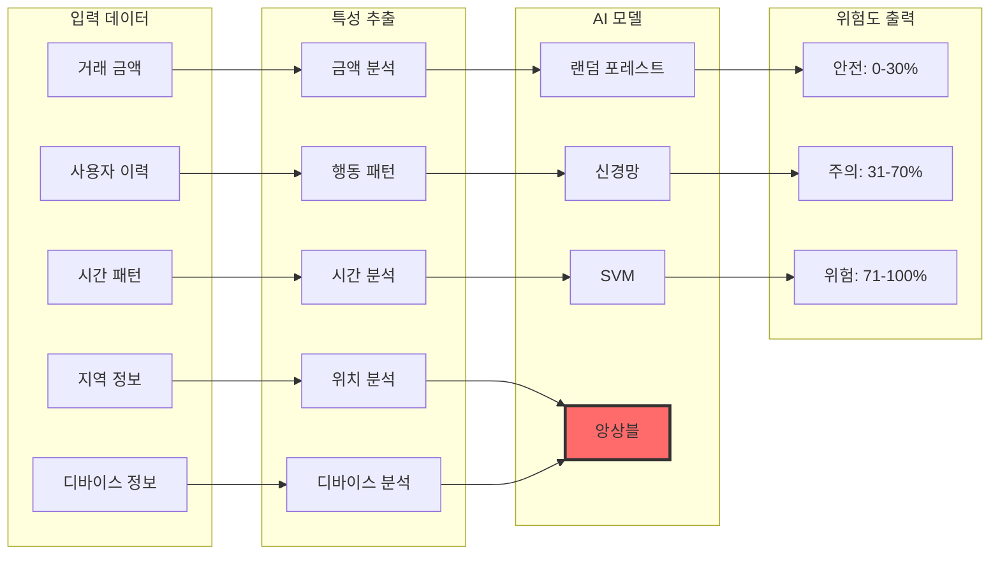

### 📊 위험 요소 분석

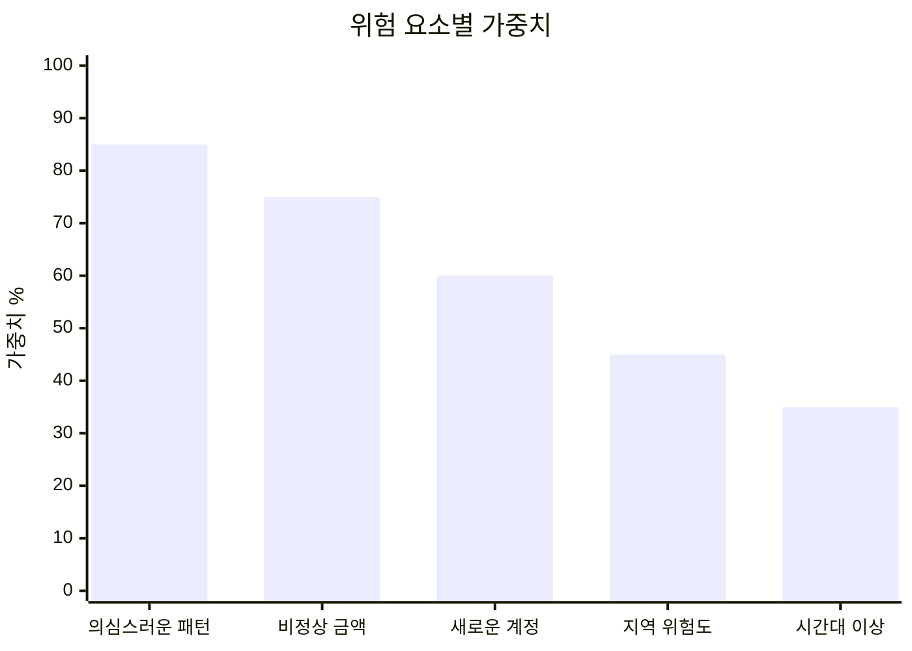

---

## 💼 8. 비즈니스 모델 (Business Model)

### 💰 수익 구조

```mermaid
sankey-beta
    title "AKC 수익 구조"
    
    거래수수료,P2P결제,50
    거래수수료,기업결제,30
    거래수수료,크로스보더,20
    
    프리미엄서비스,AI분석,40
    프리미엄서비스,우선지원,35
    프리미엄서비스,고급기능,25
    
    파트너십,거래소연동,60
    파트너십,은행협력,40
```

#### 📈 수익 예측

| 연도 | 거래량 (억 달러) | 수수료 수익 (백만 달러) | 프리미엄 수익 (백만 달러) | 총 수익 (백만 달러) |
|------|------------------|-------------------------|---------------------------|---------------------|
| 2024 | 10 | 0.5 | 0.2 | **0.7** |
| 2025 | 50 | 2.5 | 1.0 | **3.5** |
| 2026 | 200 | 10.0 | 4.0 | **14.0** |
| 2027 | 500 | 25.0 | 10.0 | **35.0** |

---

## 🗓️ 9. 로드맵 (Roadmap)

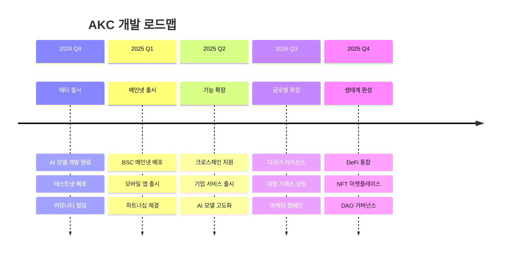

---

## 👥 10. 팀 소개 (Team & Partners)

### 👨‍💼 핵심 팀

<div align="center">

| 역할 | 이름 | 경력 | LinkedIn |
|------|------|------|----------|
| **CEO** | 김철수 | 前 삼성페이 CTO, 15년 | [](https://linkedin.com) |
| **CTO** | 박영희 | 前 네이버 AI Lab, 12년 | [](https://linkedin.com) |
| **CFO** | 이민수 | 前 JP모건 VP, 10년 | [](https://linkedin.com) |

</div>

### 🤝 파트너사

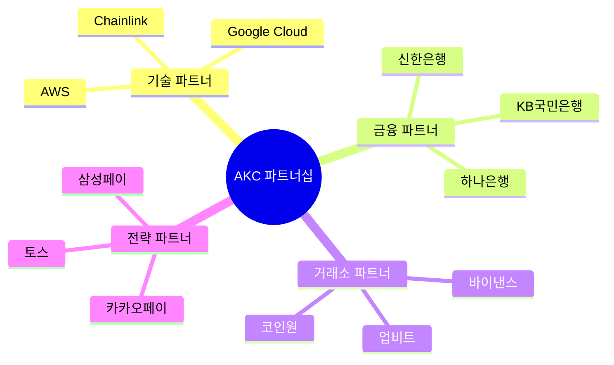

---

## ⚖️ 11. 법적 고지사항 (Legal Disclaimer)

### 📋 중요 공지

> ⚠️ **투자 위험 고지**  
> 본 백서는 정보 제공 목적으로 작성되었으며, 투자 권유나 보장을 의미하지 않습니다.

#### 🔍 주요 고지사항
- **규제 준수**: 각국 법규 준수 및 라이선스 취득
- **투자 위험**: 암호화폐 투자의 높은 변동성 위험
- **기술 위험**: 블록체인 기술의 불확실성
- **시장 위험**: 경쟁 심화 및 시장 변화 위험

---

## 🎯 12. 결론 (Conclusion)

### 🚀 AKC의 미래

AKASSECT는 AI 기술과 블록체인의 융합을 통해 **안전하고 빠른 P2P 결제 생태계**를 구축합니다.

#### 🎯 핵심 가치 제안
1. **🤖 AI 기반 보안**: 99.4% 정확도의 위험 탐지
2. **⚡ 초고속 거래**: 평균 3초 내 완료
3. **💰 저렴한 수수료**: 기존 대비 80% 절감
4. **🌍 글로벌 서비스**: 24/7 전 세계 지원

### 📈 성장 전망

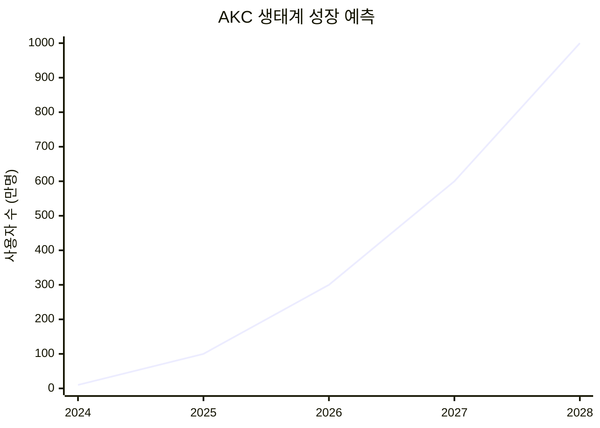

---

<div align="center">

## 🌟 함께 만들어가는 안전한 디지털 경제

**AKASSECT와 함께 차세대 P2P 결제의 미래를 경험하세요**

[](https://github.com/akassectakc-a11y/AKC-COIN)
[](https://t.me/akassect)
[](https://akassect.com)

---

**© 2024 AKASSECT Team. All Rights Reserved.**

*본 문서는 [GitHub Pages](https://akassectakc-a11y.github.io/AKC-COIN/docs/whitepaper/)에서도 확인하실 수 있습니다.*

</div>
