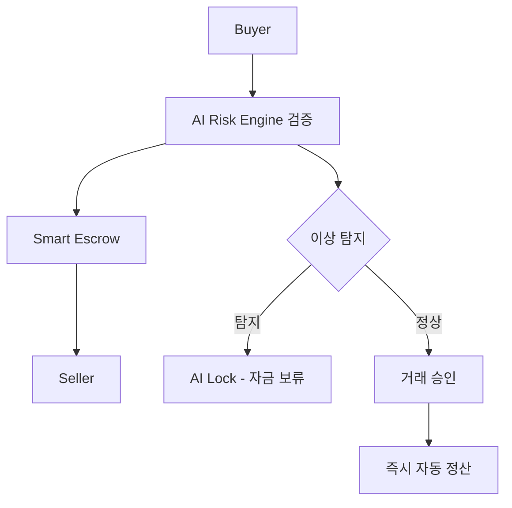

# 🤖 AKC (AI-K Coin) 백서  
**AI 기반 가상 P2P 결제 및 안전거래 시스템**  
**Version:** 1.0  
**작성일:** 2025-11  
**토큰 표준:** BEP-20 (Binance Smart Chain)  
**총 발행량:** 300,000,000 AKC  
**컨트랙트 주소:** 0x02D8b729885290a3CA724F3Df5793b74Ff226A17

---

## 📋 목차 (Table of Contents)

1. [서론 (Introduction)](#1-서론-introduction)
   - 1.1 프로젝트 개요
   - 1.2 비전과 미션
   - 1.3 시장의 문제점
   - 1.4 AKC의 해결 방안

2. [시스템 개요 (System Overview)](#2-시스템-개요-system-overview)
   - 2.1 구조 요약
   - 2.2 동작 시나리오

3. [기술 구조 (Technical Architecture)](#3-기술-구조-technical-architecture)
   - 3.1 전체 아키텍처
   - 3.2 핵심 기능
   - 3.3 AI 위험탐지 알고리즘

4. [AKC 코인 구조 (AKC Token Structure)](#4-akc-코인-구조-akc-token-structure)
   - 4.1 토큰 기본 정보
   - 4.2 토큰 분배
   - 4.3 코인 활용성

5. [안전결제 메커니즘 (Secure Payment Mechanism)](#5-안전결제-메커니즘-secure-payment-mechanism)
   - 5.1 스마트 에스크로 구조
   - 5.2 결제 흐름

6. [AI 위험분석 시스템](#6-ai-위험분석-시스템)
7. [비즈니스 모델 (Business Model)](#7-비즈니스-모델-business-model)
8. [로드맵 (Roadmap)](#8-로드맵-roadmap)
9. [팀 및 파트너 (Team & Partners)](#9-팀-및-파트너-team--partners)
10. [법률 및 면책 (Legal & Disclaimer)](#10-법률-및-면책-legal--disclaimer)
11. [결론 (Conclusion)](#11-결론-conclusion)
12. [부록 (Appendix)](#12-부록-appendix)

---

## 1. 서론 (Introduction)

### 1.1 프로젝트 개요
AKC는 AI 기술을 결합한 **가상 P2P 안전결제 시스템**으로,  
개인 간 거래(Peer-to-Peer)를 **신뢰할 수 있는 환경에서 실시간 결제**하도록 설계된  
**AI 결제 프로토콜형 디지털 자산 프로젝트**입니다.

### 1.2 비전과 미션
- **비전:** 중앙화된 결제 시스템을 대체하는 완전한 탈중앙 결제 생태계 구축  
- **미션:** 인공지능을 활용하여 거래 위험을 실시간 분석하고,  
  사용자에게 안전한 결제 환경을 제공  

### 1.3 시장의 문제점
- P2P 거래 시 사기 및 결제불이행 위험  
- 결제 중개 수수료 부담  
- 사용자 간 신뢰 부재로 인한 거래 중단  

### 1.4 AKC의 해결 방안
- AI 위험탐지 모델을 통한 **사기 거래 사전 차단**  
- **스마트컨트랙트 기반 자동 결제 보증 시스템**  
- 거래 완료 시점까지 **안전 에스크로(escrow) 보관 메커니즘**

---

## 2. 시스템 개요 (System Overview)

### 2.1 구조 요약
AKC의 AI 가상 P2P 결제 시스템은 다음 3가지 축으로 구성됩니다:
1. **AI Risk Engine (위험분석엔진)**  
2. **Smart Escrow Contract (안전보관계약)**  
3. **Decentralized Payment Network (분산결제망)**  

### 2.2 동작 시나리오
1. 거래 요청 발생 (Buyer → Seller)  
2. AI 엔진이 신뢰도, 패턴, 과거 이력 기반 **위험 점수 산정**  
3. 위험이 낮을 경우 스마트컨트랙트가 **안전 예치 결제 실행**  
4. 거래 완료 후 AI 엔진이 **검증 및 자동 정산 처리**

---

## 3. 기술 구조 (Technical Architecture)

### 3.1 전체 아키텍처
- **네트워크:** Binance Smart Chain (BEP-20)  
- **AI 모델:** Risk Scoring / Behavior Analysis / Fraud Detection  
- **결제 엔진:** Solidity 기반 Smart Escrow Contract  
- **데이터 모듈:** Real-time Transaction Indexer (Node.js 기반)

### 3.2 핵심 기능
| 기능 | 설명 |
|------|------|
| AI 위험평가 | 거래 전 실시간 신뢰 점수 산정 |
| 스마트 예치 | 양 당사자 결제 자금 스마트컨트랙트 예치 |
| 자동 정산 | 거래 완료 시점 AI 검증 후 자동 송금 |
| 분쟁 해결 | AI 심사 로그 기반 자동/수동 보상 처리 |
| 익명성 보장 | 개인정보 없이 지갑주소 기반 신원관리 |

### 3.3 AI 위험탐지 알고리즘
- 거래이력 패턴분석 (Transaction Pattern Recognition)  
- 지갑 신뢰도 평가 (Wallet Trust Index)  
- 머신러닝 기반 이상거래 탐지 (Anomaly Detection)  

---

## 4. AKC 코인 구조 (AKC Token Structure)

### 4.1 토큰 기본 정보
| 항목 | 내용 |
|------|------|
| 토큰명 | AKC (AKASSECT) |
| 표준 | BEP-20 |
| 총 발행량 | 300,000,000 |
| 네트워크 | Binance Smart Chain |
| 컨트랙트 주소 | 0x02D8b729885290a3CA724F3Df5793b74Ff226A17 |

### 4.2 토큰 분배
| 구분 | 비율 | 용도 |
|------|------|------|
| 보안 예치(결제 보증) | 30% | AI 보증형 결제 리저브 |
| 커뮤니티 리워드 | 25% | 거래 참여 보상 |
| 파트너 및 연동사 | 20% | 결제 시스템 제휴 |
| 개발 및 운영 | 15% | 시스템 유지보수 |
| 예비금 | 10% | 비상 유동성 확보 |

### 4.3 코인 활용성
- P2P 거래 결제수단  
- 스마트 에스크로 예치금  
- 거래 리워드 / 수수료 감면  
- AI 위험분석 서비스 이용료  

---

## 5. 안전결제 메커니즘 (Secure Payment Mechanism)

### 5.1 스마트 에스크로 구조
- 양측 자금은 거래 완료 전까지 **중립지갑(Safe Wallet)**에 예치  
- AI가 결제조건 충족 여부를 검증 후 자동 송금  

### 5.2 결제 흐름

**단계별 설명:**
1. **Buyer → AI Risk Engine:** 구매자 거래 요청 및 위험도 분석
2. **AI Risk Engine 검증:** 실시간 사기패턴 탐지 및 신뢰도 평가
3. **Smart Escrow:** 안전 점수 기반 자동 예치 실행
4. **거래 중 모니터링:** AI가 거래 과정 실시간 감시
5. **이상 탐지 시:** 자금 자동 보류 (AI Lock) 및 분쟁 해결 프로세스
6. **거래 승인 시:** 즉시 자동 정산 및 Seller에게 송금

### 5.3 보안 강화 요소
- **AI 기반 사기패턴 탐지:** 실시간 거래 패턴 분석 및 이상행위 탐지
- **다중서명(Multi-Sig) 기반 결제 서명:** 보안성 강화를 위한 다중 승인 시스템
- **거래 로그 AI 감시 (Audit Node):** 모든 거래 기록의 AI 기반 실시간 감사

---

## 6. AI 위험분석 시스템

### 6.1 위험 점수 산정 요소
- **거래 이력:** 과거 성공/실패 거래 비율
- **지갑 연령:** 지갑 생성 후 경과 시간
- **거래 패턴:** 비정상적 거래 빈도 탐지
- **네트워크 신뢰도:** 연결된 지갑들의 평판

### 6.2 머신러닝 모델
- **Random Forest:** 다중 변수 기반 위험도 예측
- **Neural Network:** 복잡한 거래 패턴 학습
- **Anomaly Detection:** 이상 거래 실시간 탐지

---

## 7. 비즈니스 모델 (Business Model)

### 7.1 수익 구조
- **거래 수수료:** 0.1~0.3% (거래 규모 및 위험도에 따라 차등 적용)
- **AI 분석 서비스 구독모델:** 월 정액제 프리미엄 위험분석 서비스
- **결제보증 수수료:** 고액 거래 시 추가 보증 서비스 제공

### 7.2 파트너십
- **블록체인 결제 게이트웨이 연동:** 기존 결제 시스템과의 호환성 확보
- **DeFi/RWA 결제통합 서비스:** 탈중앙화 금융 생태계 연동
- **전자상거래 플랫폼 제휴:** 온라인 쇼핑몰 결제 시스템 통합

### 7.3 확장성
- **웹/앱 결제 SDK 제공:** 개발자를 위한 간편 통합 도구
- **거래소, 쇼핑몰, 메타버스 결제 연동:** 다양한 플랫폼 지원
- **크로스체인 결제 지원:** 다중 블록체인 네트워크 호환

---

## 8. 로드맵 (Roadmap)

| 기간 | 주요 목표 |
|------|-----------|
| 2025 Q4 | AKC BEP-20 배포 및 내부 테스트 |
| 2026 Q1 | AI Risk Engine 프로토타입 완성 |
| 2026 Q2 | Smart Escrow P2P 결제 서비스 런칭 |
| 2026 Q3 | 거래소 상장 및 글로벌 결제 연동 |
| 2027 Q1 | 자체 AI Mainnet 전환 (AINOVA Integration) |

### 세부 개발 단계

**Phase 1: 기반 구축 (2025 Q4)**
- [x] AKC 토큰 BSC 메인넷 배포 완료
- [x] 기본 스마트 컨트랙트 개발
- [ ] AI 위험분석 모델 개발

**Phase 2: AI 엔진 개발 (2026 Q1)**
- [ ] AI Risk Engine 프로토타입 완성
- [ ] 머신러닝 모델 훈련 및 최적화
- [ ] 보안 감사 및 테스트

**Phase 3: 서비스 런칭 (2026 Q2)**
- [ ] Smart Escrow P2P 결제 서비스 런칭
- [ ] 베타 사용자 테스트
- [ ] 모바일 앱 출시

**Phase 4: 생태계 확장 (2026 Q3)**
- [ ] 거래소 상장 및 글로벌 결제 연동
- [ ] 파트너십 확대
- [ ] 다중 체인 지원

**Phase 5: AI 메인넷 (2027 Q1)**
- [ ] 자체 AI Mainnet 전환 (AINOVA Integration)
- [ ] 완전 탈중앙화 거버넌스 구현
- [ ] 글로벌 서비스 확장

---

## 9. 팀 및 파트너 (Team & Partners)

### 핵심 팀
- **Founder & CEO:** Wonyong Hwang
- **Lead Blockchain Developer:** (추가 예정)
- **AI Research Partner:** AINOVA AI Lab
- **Security Auditor:** (외부 감사 예정)

### 개발팀
- **AI 개발:** 머신러닝 및 위험분석 모델 개발
- **블록체인 개발:** 스마트컨트랙트 및 DApp 개발
- **백엔드 개발:** 결제 시스템 및 API 개발

### 보안팀
- **스마트컨트랙트 감사**
- **시스템 보안 검증**
- **위험 관리**

### 파트너십
- **AINOVA AI Lab:** AI 기술 연구 및 개발 파트너
- **보안 감사 파트너:** (선정 예정)
- **거래소 파트너:** (협의 중)

---

## 10. 법률 및 면책 (Legal & Disclaimer)

### 면책 조항
- 본 프로젝트는 금융상품이 아니며, 투자 손실에 대한 책임은 전적으로 사용자에게 있습니다
- 본 백서는 정보 제공 목적으로 작성되었습니다
- 투자 권유나 금융 조언이 아닙니다
- 규제 변화에 따라 내용이 변경될 수 있습니다

### 규정 준수
- **KYC / AML 정책 준수:** 자금세탁방지 및 고객확인 절차 준수
- **각국 법규 준수:** 각국 법규에 따라 서비스 범위가 제한될 수 있습니다
- **데이터 보호:** GDPR 및 개인정보보호법 준수

### 위험 고지
- 암호화폐 투자는 높은 위험을 수반합니다
- 투자 전 충분한 검토가 필요합니다
- 손실 가능성을 인지하고 투자하시기 바랍니다
- 기술적 위험, 규제 위험, 시장 위험 등이 존재합니다

---

## 11. 결론 (Conclusion)

AKC는 **AI와 블록체인을 결합한 차세대 P2P 결제 플랫폼**으로,  
신뢰·투명·보안이라는 3대 핵심가치를 중심으로 작동합니다.

### 핵심 가치 제안
- **신뢰:** AI 기반 위험분석을 통한 거래 신뢰성 확보
- **투명:** 블록체인 기반 모든 거래 기록의 투명성
- **보안:** 다중 보안 계층을 통한 안전한 결제 환경

### 비전 실현
AI 분석을 통한 거래 안전성과 **사용자 보호 중심의 디지털 결제 혁신**을 목표로,  
전 세계 P2P 거래 시장에서 새로운 표준을 제시하고자 합니다.

### 기대 효과
- P2P 거래 사기 위험 90% 이상 감소
- 거래 중개 수수료 50% 이상 절감
- 실시간 AI 분석을 통한 즉시 결제 시스템 구현

---

## 12. 부록 (Appendix)

### A. 기술 사양서
- **스마트컨트랙트 구조도**
- **AI 위험평가 모델 구조**
- **거래 플로우 시퀀스 다이어그램**
- **기술 사양서 (Solidity / Node.js / AI Model Spec)**

### B. 추가 자료
- **컨트랙트 소스코드:** [GitHub Repository]
- **API 문서:** [개발자 문서]
- **보안 감사 보고서:** [감사 완료 후 공개]
- **파트너십 MOU:** [체결 후 공개]

### C. 연락처 및 커뮤니티
- **공식 웹사이트:** [추후 공개]
- **개발자 문서:** [추후 공개]
- **GitHub:** [Repository Link]
- **커뮤니티 채널:** [추후 공개]

---

**© 2025 AKC Project Team. All rights reserved.**

---

### 연락처
- **웹사이트:** [추후 공개]
- **이메일:** [추후 공개]
- **텔레그램:** [추후 공개]
- **트위터:** [추후 공개]
