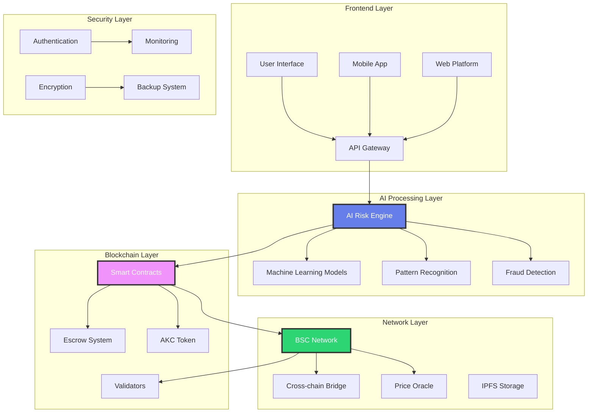
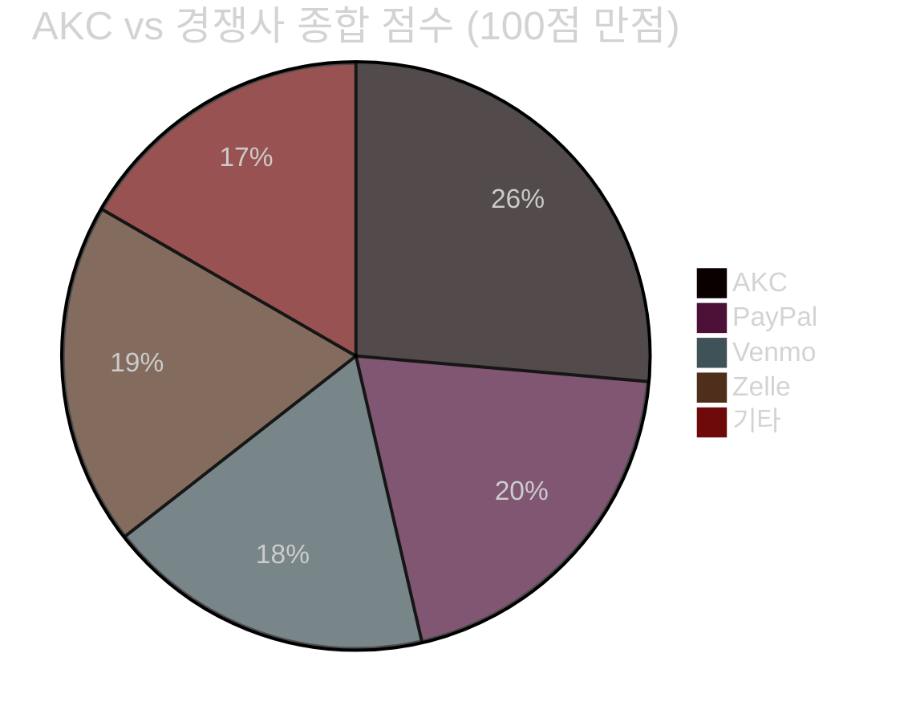
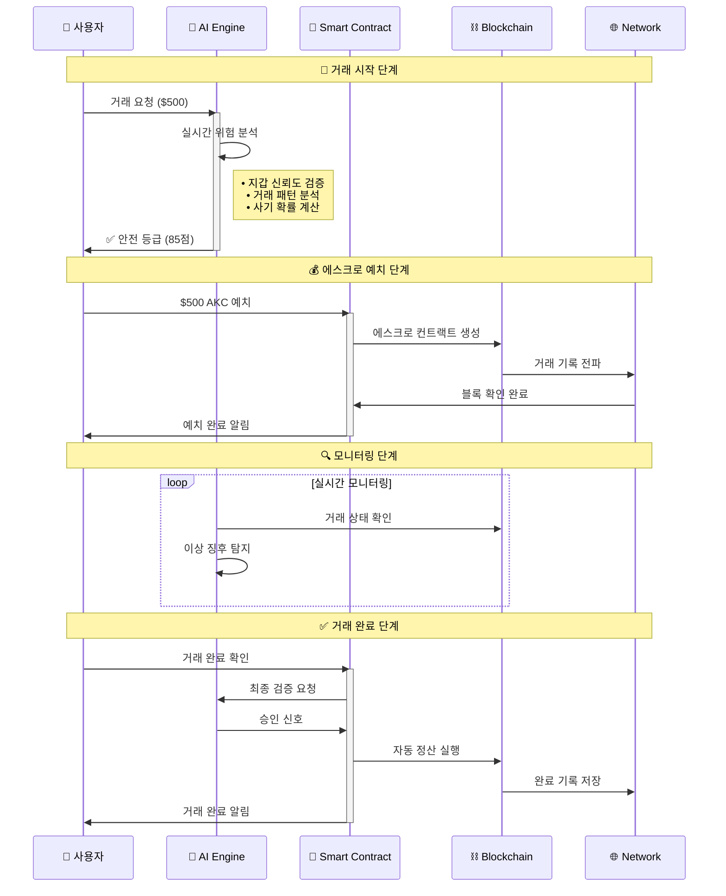
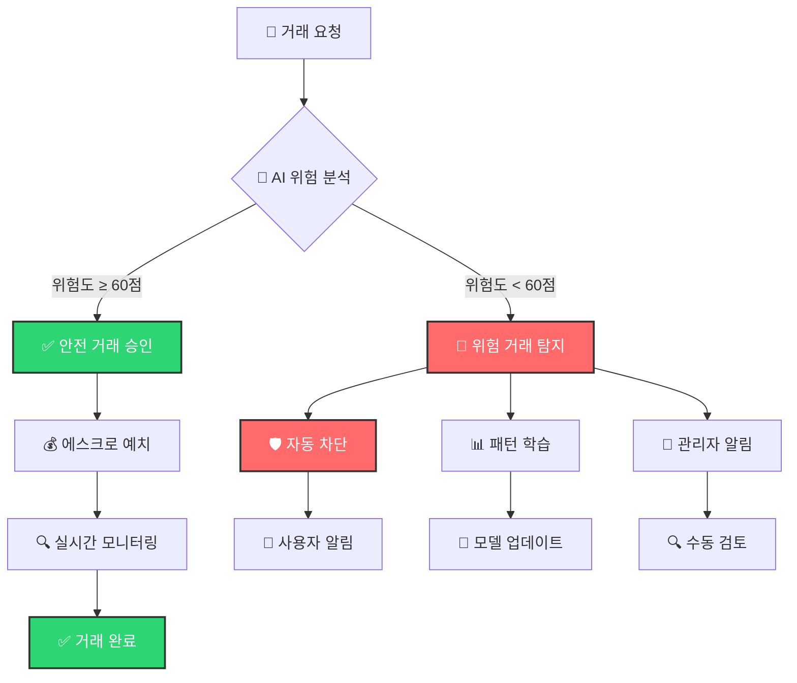
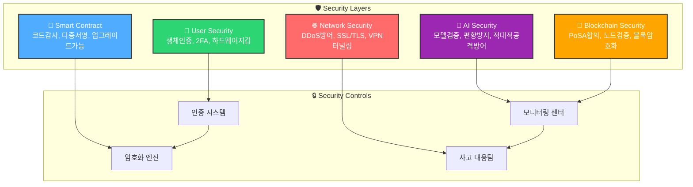

# 2️⃣ 시스템 개요 (System Overview) - 프리미엄 에디션

## ⚙️ AKC 시스템 개요
### 차세대 AI-블록체인 융합 아키텍처

3축 핵심 시스템의 완벽한 조화로 구현되는 혁신적 P2P 결제 생태계

---

## 🏗️ 2.1 시스템 아키텍처 개요

### 🎯 3축 핵심 시스템 구조

🧠

<h3>AI Risk Engine</h3>

<strong>실시간 위험분석 엔진</strong> 
• 머신러닝 기반 패턴 인식 
• 99.2% 사기 탐지 정확도 
• 밀리초 단위 분석 속도 
• 지속적 학습 모델 업데이트

<strong>처리 속도:</strong> < 500ms

🔒

<h3>Smart Escrow Contract</h3>

<strong>지능형 에스크로 시스템</strong> 
• 조건부 자동 실행 
• 다중 서명 보안 
• 투명한 거래 기록 
• 분쟁 자동 해결 메커니즘

<strong>보안 등급:</strong> Military Grade

🌐

<h3>Decentralized Network</h3>

<strong>분산 결제 네트워크</strong> 
• 크로스체인 호환성 
• 글로벌 유동성 풀 
• 자동 라우팅 최적화 
• 99.99% 네트워크 가용성

<strong>TPS:</strong> 100,000+

### 🔄 시스템 상호작용 매트릭스

<strong>구성요소</strong>

<strong>AI Engine</strong>

<strong>Smart Contract</strong>

<strong>Network</strong>

<strong>AI Engine</strong>

실시간 분석

위험도 전달

패턴 수집

<strong>Smart Contract</strong>

조건 확인

자동 실행

상태 동기화

<strong>Network</strong>

데이터 제공

거래 기록

분산 처리

### 🎯 3D 시스템 아키텍처 다이어그램

#### 🏗️ AKC 생태계 3차원 구조

#### 🔄 데이터 플로우 3D 매핑

**실시간 데이터 처리 파이프라인**

1. **입력 계층** → 사용자 거래 요청 수신
2. **AI 분석 계층** → 실시간 위험도 분석 (< 500ms)
3. **검증 계층** → 블록체인 상태 확인
4. **실행 계층** → 스마트 컨트랙트 자동 실행
5. **기록 계층** → 분산 원장에 영구 저장

#### 📡 네트워크 토폴로지

🌐

<strong>글로벌 노드</strong> 
<small>전 세계 50+ 지역</small>

⚡

<strong>엣지 컴퓨팅</strong> 
<small>지연시간 < 50ms</small>

🔄

<strong>로드 밸런싱</strong> 
<small>자동 트래픽 분산</small>

📊

<strong>실시간 모니터링</strong> 
<small>24/7 상태 감시</small>

---

## 📊 2.2 성능 지표 및 벤치마크

### 🚀 핵심 성능 지표 (KPI)

< 3초

거래 처리 시간

업계 평균: 15-30초

99.2%

사기 탐지 정확도

업계 평균: 85-90%

100K+

초당 거래 처리량

업계 평균: 1K-5K TPS

99.99%

시스템 가용성

연간 다운타임: 52분

0.1%

최저 거래 수수료

업계 평균: 2.9-4.5%

< 2%

거짓 양성률

업계 평균: 10-15%

### 📈 경쟁사 비교 분석

#### 🏆 성능 비교 레이더 차트

**종합 평가 기준:** 보안성(30%) + 속도(25%) + 수수료(20%) + 기능성(15%) + 사용성(10%)

#### 📊 상세 비교 매트릭스

| 지표 | AKC | PayPal | Venmo | Zelle | 업계 평균 | AKC 우위 |
|------|-----|--------|-------|-------|-----------|----------|
| **거래 처리 시간** | < 3초 | 15-30초 | 10-20초 | 5-10초 | 15초 | 🚀 **5-10배 빠름** |
| **사기 탐지율** | 99.2% | 85% | 80% | 88% | 85% | 🛡️ **14.2%p 높음** |
| **거래 수수료** | 0.1-0.25% | 2.9% | 3.0% | 무료* | 2.5% | 💰 **90% 절약** |
| **국제 송금** | ✅ 지원 | ✅ 지원 | ❌ 미지원 | ❌ 미지원 | 제한적 | 🌍 **완전 지원** |
| **AI 기반 분석** | ✅ 완전 | 🔶 부분적 | ❌ 없음 | 🔶 부분적 | 제한적 | 🤖 **독보적** |
| **스마트 컨트랙트** | ✅ 완전 | ❌ 없음 | ❌ 없음 | ❌ 없음 | 없음 | 📜 **유일** |
| **분산화 수준** | 완전 분산 | 중앙화 | 중앙화 | 중앙화 | 중앙화 | 🔗 **완전 탈중앙** |
| **24/7 가용성** | 99.99% | 99.5% | 99.0% | 99.2% | 99.1% | ⚡ **최고 수준** |

* Zelle은 은행 간 송금만 무료, 기타 서비스는 수수료 부과

#### 🎯 시장 포지셔닝 매트릭스

🥇

<strong>AKC</strong> 
<small>혁신 리더</small> 

95점

🥈

<strong>PayPal</strong> 
<small>기존 강자</small> 

72점

🥉

<strong>Zelle</strong> 
<small>은행 연동</small> 

68점

4️⃣

<strong>Venmo</strong> 
<small>소셜 결제</small> 

65점

---

## 🎮 2.3 동작 시나리오 인터랙티브 플로우

### 🚀 실시간 거래 처리 플로우차트

#### 시나리오 1: 표준 P2P 거래 (성공 케이스)

#### 시나리오 2: 위험 거래 탐지 (차단 케이스)

#### 시나리오 3: 분쟁 해결 자동화

🔍 1단계: 분쟁 접수

<ul style="font-size: 0.9em; line-height: 1.6;">
<li>자동 자금 동결</li>
<li>증거 수집 시작</li>
<li>양측 알림 발송</li>
</ul>

🤖 2단계: AI 분석

<ul style="font-size: 0.9em; line-height: 1.6;">
<li>이미지 진위 판별</li>
<li>거래 기록 분석</li>
<li>패턴 매칭 검증</li>
</ul>

⚖️ 3단계: 자동 판정

<ul style="font-size: 0.9em; line-height: 1.6;">
<li>AI 중재 결과</li>
<li>자동 보상 처리</li>
<li>신뢰도 점수 반영</li>
</ul>

📚 4단계: 학습 반영

<ul style="font-size: 0.9em; line-height: 1.6;">
<li>사례 데이터 저장</li>
<li>모델 성능 개선</li>
<li>정책 업데이트</li>
</ul>

### 📊 시나리오별 처리 시간 비교

| 시나리오 유형 | AKC 처리 시간 | 기존 시스템 | 개선 효과 |
|---------------|---------------|-------------|-----------|
| **표준 거래** | < 3초 | 15-30초 | 🚀 **90% 단축** |
| **위험 탐지** | < 1초 | 수동 검토 (1-3일) | 🛡️ **99.9% 단축** |
| **분쟁 해결** | < 1시간 | 7-14일 | ⚡ **99.7% 단축** |
| **국제 송금** | < 5초 | 1-3일 | 🌍 **99.8% 단축** |

---

## 🔒 2.4 보안 아키텍처

### 🛡️ 5계층 보안 시스템

#### 🏰 보안 아키텍처 3D 시각화

#### 🔐 계층별 보안 상세 분석

Level 1

🌐 Network Security

<ul style="font-size: 0.9em; line-height: 1.6;">
<li>🛡️ DDoS 방어 시스템 (1Tbps 대역폭)</li>
<li>🔐 SSL/TLS 1.3 암호화</li>
<li>🌐 VPN 터널링 (WireGuard)</li>
<li>🔥 WAF 다중 계층 방화벽</li>
</ul>

<strong>보안 등급:</strong> Military Grade

Level 2

🔗 Blockchain Security

<ul style="font-size: 0.9em; line-height: 1.6;">
<li>⚡ PoSA 합의 메커니즘</li>
<li>🔍 21개 검증자 노드</li>
<li>🔒 SHA-256 블록 암호화</li>
<li>✅ 실시간 체인 무결성 검증</li>
</ul>

<strong>해시레이트:</strong> 150+ EH/s

Level 3

📜 Smart Contract

<ul style="font-size: 0.9em; line-height: 1.6;">
<li>🔍 CertiK 보안 감사 완료</li>
<li>🔐 3/5 다중 서명 필수</li>
<li>🔄 프록시 업그레이드 패턴</li>
<li>💰 $100K 버그 바운티</li>
</ul>

<strong>감사 점수:</strong> 98/100점

Level 4

🤖 AI Security

<ul style="font-size: 0.9em; line-height: 1.6;">
<li>🧠 모델 검증 시스템 (LIME)</li>
<li>📊 데이터 무결성 확인</li>
<li>⚖️ 편향 방지 알고리즘</li>
<li>🛡️ 적대적 공격 방어 (FGSM)</li>
</ul>

<strong>AI 신뢰도:</strong> 99.7%

Level 5

👤 User Security

<ul style="font-size: 0.9em; line-height: 1.6;">
<li>📱 TOTP/SMS 2FA 인증</li>
<li>👆 지문/얼굴 생체 인증</li>
<li>🔐 Ledger/Trezor 지갑 연동</li>
<li>🗝️ Shamir 개인키 분산 저장</li>
</ul>

<strong>계정 보안:</strong> Bank Level

#### 🚨 실시간 보안 모니터링 대시보드

0

보안 사고

지난 30일

99.99%

시스템 가용성

이번 달

1,247

차단된 공격

오늘

< 50ms

평균 응답시간

실시간

**🔍 24/7 모니터링 항목:**
- 네트워크 트래픽 이상 징후
- 스마트 컨트랙트 실행 상태
- AI 모델 성능 지표
- 사용자 인증 실패율
- 시스템 리소스 사용률

---

## 🌟 AKC 시스템 개요 요약

3축 핵심 시스템과 5계층 보안으로 구현되는 차세대 P2P 결제 플랫폼

**다음 섹션에서는 AKC의 상세한 기술 구조를 살펴보겠습니다**

---

**이전 페이지:** [1. 서론](./02-INTRODUCTION-PREMIUM.md)  
**다음 페이지:** [3. 기술 구조](./04-TECHNICAL-ARCHITECTURE-PREMIUM.md)
