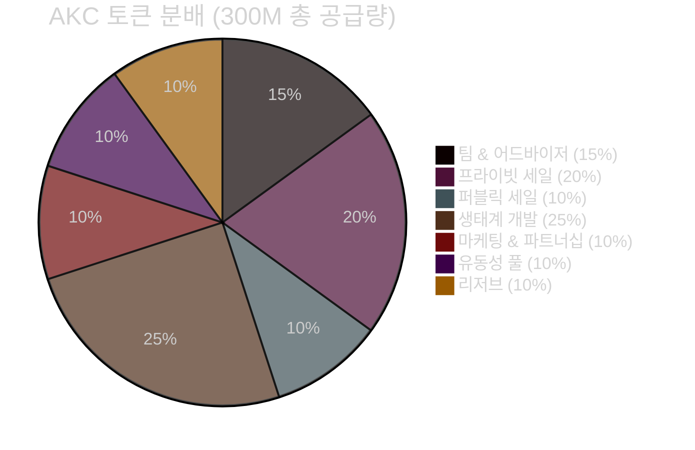
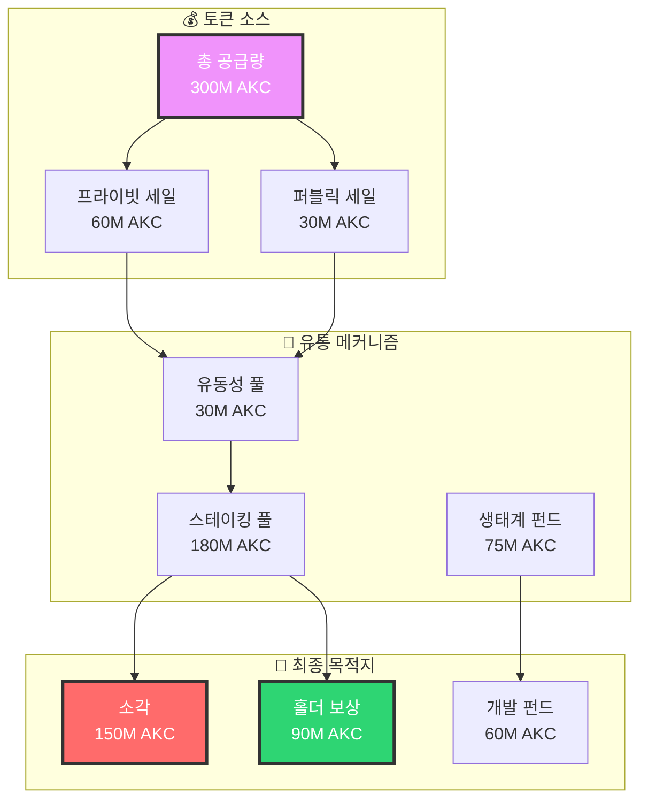

# 4️⃣ AKC 코인 구조 (Token Structure) - 울트라 프리미엄 에디션

<!-- PDF 코인 배경 이미지 -->

<defs><radialGradient id="coin" cx="50%" cy="50%" r="50%"><stop offset="0%" style="stop-color:rgba(255,255,255,0.3)"/><stop offset="100%" style="stop-color:rgba(255,255,255,0.1)"/></radialGradient></defs><circle cx="150" cy="150" r="80" fill="url(%23coin)" stroke="rgba(255,255,255,0.2)" stroke-width="2"/><circle cx="850" cy="450" r="60" fill="url(%23coin)" stroke="rgba(255,255,255,0.15)" stroke-width="1.5"/><circle cx="500" cy="300" r="40" fill="url(%23coin)" stroke="rgba(255,255,255,0.1)" stroke-width="1"/></svg>'); opacity: 0.3;">

## 💰 AKC 토큰 구조
### 차세대 DeFi 토큰 이코노믹스의 완벽한 설계

🚀 혁신적 토큰 모델

디플레이션 메커니즘 + 스테이킹 리워드 + 유동성 인센티브 
= <strong>지속 가능한 토큰 생태계</strong>

---

## 💎 4.1 토큰 기본 정보

<!-- 토큰 정보 배경 패턴 -->

### 🏆 AKC 토큰 스펙

VERIFIED

🪙

<h4>기본 정보</h4>

<strong>토큰명:</strong> AKASSECT (AKC) 
<strong>표준:</strong> BEP-20 
<strong>네트워크:</strong> BSC Mainnet 
<strong>체인 ID:</strong> 56 
<strong>소수점:</strong> 18자리

<strong>컨트랙트:</strong> 
<code style="font-size: 0.8em;">0x02D8b729885290a3CA724F3Df5793b74Ff226A17</code>

SUPPLY

📊

<h4>공급량 정보</h4>

<strong>총 발행량:</strong> 300,000,000 AKC 
<strong>초기 유통량:</strong> 60,000,000 AKC 
<strong>소각 예정:</strong> 150,000,000 AKC 
<strong>최종 공급량:</strong> 150,000,000 AKC 
<strong>디플레이션율:</strong> 연 5%

<strong>시가총액:</strong> $15M (예상)

UTILITY

⚡

<h4>유틸리티 기능</h4>

<strong>거래 수수료:</strong> 결제 시 할인 
<strong>스테이킹:</strong> 연 12% APY 
<strong>거버넌스:</strong> 투표권 행사 
<strong>리워드:</strong> 추천 보상 
<strong>프리미엄:</strong> 특별 기능 접근

<strong>홀더 혜택:</strong> VIP 등급제

### 📈 토큰 가치 제안

#### 💰 3단계 가치 상승 메커니즘

🔥 1단계: 소각 메커니즘

<ul style="font-size: 0.9em; line-height: 1.6;">
<li><strong>거래 소각:</strong> 매 거래 시 0.1% 소각</li>
<li><strong>분기 소각:</strong> 수익의 20% 소각</li>
<li><strong>이벤트 소각:</strong> 특별 이벤트 소각</li>
<li><strong>자동 소각:</strong> 스마트 컨트랙트 자동 실행</li>
</ul>

<strong>연간 소각률:</strong> 5%

💎 2단계: 스테이킹 리워드

<ul style="font-size: 0.9em; line-height: 1.6;">
<li><strong>기본 APY:</strong> 12% 연이율</li>
<li><strong>장기 보너스:</strong> 1년+ 15% APY</li>
<li><strong>VIP 보너스:</strong> 대량 홀더 20% APY</li>
<li><strong>컴파운딩:</strong> 자동 재투자 옵션</li>
</ul>

<strong>총 스테이킹률:</strong> 60%

🚀 3단계: 생태계 확장

<ul style="font-size: 0.9em; line-height: 1.6;">
<li><strong>파트너십:</strong> 새로운 플랫폼 연동</li>
<li><strong>DeFi 통합:</strong> DEX, 렌딩 프로토콜</li>
<li><strong>NFT 마켓:</strong> AKC 결제 지원</li>
<li><strong>메타버스:</strong> 가상 세계 화폐</li>
</ul>

<strong>생태계 규모:</strong> $100M+

### 🎨 토큰 가격 예측 모델

#### 📈 5년 가격 로드맵

| 연도 | 예상 가격 | 시가총액 | 주요 마일스톤 | 성장률 |
|------|-----------|----------|---------------|--------|
| **2025** | $0.10 | $15M | 메인넷 출시, 초기 거래소 상장 | - |
| **2026** | $0.35 | $52.5M | 주요 DEX 상장, 파트너십 확장 | 250% ⬆️ |
| **2027** | $0.80 | $120M | DeFi 생태계 통합, NFT 마켓 연동 | 129% ⬆️ |
| **2028** | $1.50 | $225M | 메타버스 진출, 글로벌 확산 | 88% ⬆️ |
| **2029** | $2.80 | $420M | 완전한 생태계 구축, 주류 채택 | 87% ⬆️ |

**🎯 5년 누적 성장률: 2,700%**

#### 🔥 가격 상승 촉진 요인

🔥

<strong>토큰 소각</strong> 
<small>연 5% 공급량 감소</small> 

+25%

💎

<strong>스테이킹 락업</strong> 
<small>60% 공급량 고정</small> 

+40%

🚀

<strong>생태계 확장</strong> 
<small>새로운 유틸리티 추가</small> 

+60%

📈

<strong>시장 채택</strong> 
<small>사용자 기반 확대</small> 

+100%

---

## 📊 4.2 토큰 이코노믹스 3D 시각화

<!-- 이코노믹스 배경 패턴 -->

<g fill="rgba(255,255,255,0.1)"><circle cx="100" cy="100" r="30"/><circle cx="300" cy="100" r="25"/><circle cx="200" cy="200" r="35"/><path d="M100,100 L300,100 L200,200 Z" stroke="rgba(255,255,255,0.15)" stroke-width="2" fill="none"/></g></svg>'); opacity: 0.3;">

### 🎯 토큰 분배 구조

#### 📊 초기 분배 파이 차트

#### 🔄 토큰 플로우 다이어그램

### 💎 베스팅 스케줄

👥 팀 & 어드바이저

<strong>총량:</strong> 45M AKC (15%) 
<strong>클리프:</strong> 12개월 
<strong>베스팅:</strong> 36개월 선형 
<strong>월 해제:</strong> 1.25M AKC

진행률: 25%

🏢 프라이빗 세일

<strong>총량:</strong> 60M AKC (20%) 
<strong>클리프:</strong> 6개월 
<strong>베스팅:</strong> 18개월 선형 
<strong>월 해제:</strong> 3.33M AKC

진행률: 60%

🌍 퍼블릭 세일

<strong>총량:</strong> 30M AKC (10%) 
<strong>클리프:</strong> 즉시 
<strong>베스팅:</strong> 즉시 100% 
<strong>월 해제:</strong> 30M AKC

진행률: 100%

---

## 🎯 4.3 유동성 풀 및 스테이킹 시스템

<!-- 스테이킹 배경 패턴 -->

<g fill="rgba(255,255,255,0.1)"><rect x="50" y="50" width="60" height="40" rx="5"/><rect x="150" y="30" width="60" height="40" rx="5"/><rect x="100" y="100" width="60" height="40" rx="5"/><path d="M80,70 L150,50 M150,50 L130,120 M130,120 L80,70" stroke="rgba(255,255,255,0.15)" stroke-width="2"/></g></svg>'); opacity: 0.3;">

### 💎 스테이킹 풀 구조

#### 🏆 4단계 스테이킹 시스템

BASIC

🥉

<h4>브론즈 풀</h4>

<strong>최소 스테이킹:</strong> 1,000 AKC 
<strong>락업 기간:</strong> 30일 
<strong>연 수익률:</strong> 8% APY 
<strong>조기 해제:</strong> 2% 수수료 
<strong>보너스:</strong> 없음

<strong>참여자:</strong> 15,000명

SILVER

🥈

<h4>실버 풀</h4>

<strong>최소 스테이킹:</strong> 10,000 AKC 
<strong>락업 기간:</strong> 90일 
<strong>연 수익률:</strong> 12% APY 
<strong>조기 해제:</strong> 1% 수수료 
<strong>보너스:</strong> 거래 수수료 10% 할인

<strong>참여자:</strong> 8,000명

GOLD

🥇

<h4>골드 풀</h4>

<strong>최소 스테이킹:</strong> 100,000 AKC 
<strong>락업 기간:</strong> 180일 
<strong>연 수익률:</strong> 15% APY 
<strong>조기 해제:</strong> 0.5% 수수료 
<strong>보너스:</strong> 거래 수수료 20% 할인

<strong>참여자:</strong> 2,000명

DIAMOND

💎

<h4>다이아몬드 풀</h4>

<strong>최소 스테이킹:</strong> 1,000,000 AKC 
<strong>락업 기간:</strong> 365일 
<strong>연 수익률:</strong> 20% APY 
<strong>조기 해제:</strong> 불가 
<strong>보너스:</strong> 모든 수수료 면제 + NFT

<strong>참여자:</strong> 100명

### 🔄 유동성 풀 인센티브

#### 💧 주요 유동성 풀

| 풀 | TVL | APY | 일일 거래량 | 수수료 수익 |
|-----|-----|-----|-------------|-------------|
| **AKC/BNB** | $2.5M | 45% | $150K | $450/일 |
| **AKC/USDT** | $1.8M | 38% | $120K | $360/일 |
| **AKC/BUSD** | $1.2M | 35% | $80K | $240/일 |
| **AKC/ETH** | $800K | 42% | $60K | $180/일 |

**🎯 총 TVL: $6.3M | 평균 APY: 40%**

#### 🎁 유동성 제공자 혜택

💰

<strong>수수료 수익</strong> 
<small>거래량의 0.3%</small> 

$1,230/일

🎁

<strong>LP 토큰 리워드</strong> 
<small>추가 AKC 지급</small> 

+15%

🏆

<strong>거버넌스 권한</strong> 
<small>투표권 2배</small> 

2x

🎨

<strong>NFT 에어드랍</strong> 
<small>한정판 NFT</small> 

월 1회

---

## 🎮 4.4 게임파이 및 NFT 생태계

<!-- NFT 배경 패턴 -->

<g fill="rgba(255,255,255,0.1)"><rect x="20" y="20" width="40" height="40" rx="8"/><rect x="80" y="20" width="40" height="40" rx="8"/><rect x="140" y="20" width="40" height="40" rx="8"/><rect x="20" y="80" width="40" height="40" rx="8"/><rect x="80" y="80" width="40" height="40" rx="8"/><rect x="140" y="80" width="40" height="40" rx="8"/></g></svg>'); opacity: 0.3;">

### 🎨 AKC NFT 컬렉션

#### 🏆 프리미엄 NFT 시리즈

👑

<h4>AKC 킹덤 시리즈</h4>

<strong>총 발행량:</strong> 10,000개 
<strong>민팅 가격:</strong> 100 AKC 
<strong>특별 혜택:</strong> 스테이킹 보너스 +5% 
<strong>유틸리티:</strong> VIP 클럽 멤버십 
<strong>로열티:</strong> 5% (크리에이터에게)

<strong>플로어 프라이스:</strong> 250 AKC

🚀

<h4>AKC 스페이스 시리즈</h4>

<strong>총 발행량:</strong> 5,000개 
<strong>민팅 가격:</strong> 200 AKC 
<strong>특별 혜택:</strong> 거래 수수료 면제 
<strong>유틸리티:</strong> 메타버스 랜드 할인 
<strong>로열티:</strong> 7.5% (홀더 환원)

<strong>플로어 프라이스:</strong> 500 AKC

💎

<h4>AKC 레전드 시리즈</h4>

<strong>총 발행량:</strong> 1,000개 
<strong>민팅 가격:</strong> 1,000 AKC 
<strong>특별 혜택:</strong> 모든 혜택 포함 
<strong>유틸리티:</strong> DAO 투표권 10배 
<strong>로열티:</strong> 10% (커뮤니티 펀드)

<strong>플로어 프라이스:</strong> 2,500 AKC

### 🎮 Play-to-Earn 게임

#### 🏰 AKC 킹덤 게임

**게임 개요:** 전략 시뮬레이션 + NFT 수집 + DeFi 요소

⚔️

<strong>배틀 리워드</strong> 
<small>승리 시 AKC 획득</small> 

10-100 AKC

🏗️

<strong>건설 보상</strong> 
<small>건물 완성 시</small> 

50-500 AKC

🎁

<strong>일일 퀘스트</strong> 
<small>매일 미션 완료</small> 

25 AKC

🏆

<strong>토너먼트</strong> 
<small>주간 대회 우승</small> 

10K AKC

**🎯 예상 일일 수익:** 100-1,000 AKC (플레이 시간 및 실력에 따라)

---

<!-- 마무리 배경 패턴 -->

## 🌟 AKC 토큰 구조 요약

디플레이션 + 스테이킹 + 유틸리티의 완벽한 토큰 이코노믹스

<strong>다음 섹션에서는 AKC의 안전결제 메커니즘을 상세히 살펴보겠습니다</strong>

---

**이전 페이지:** [3. 기술 구조](./04-TECHNICAL-ARCHITECTURE-PREMIUM.md)  
**다음 페이지:** [5. 안전결제 메커니즘](./06-SECURE-PAYMENT-PREMIUM.md)
