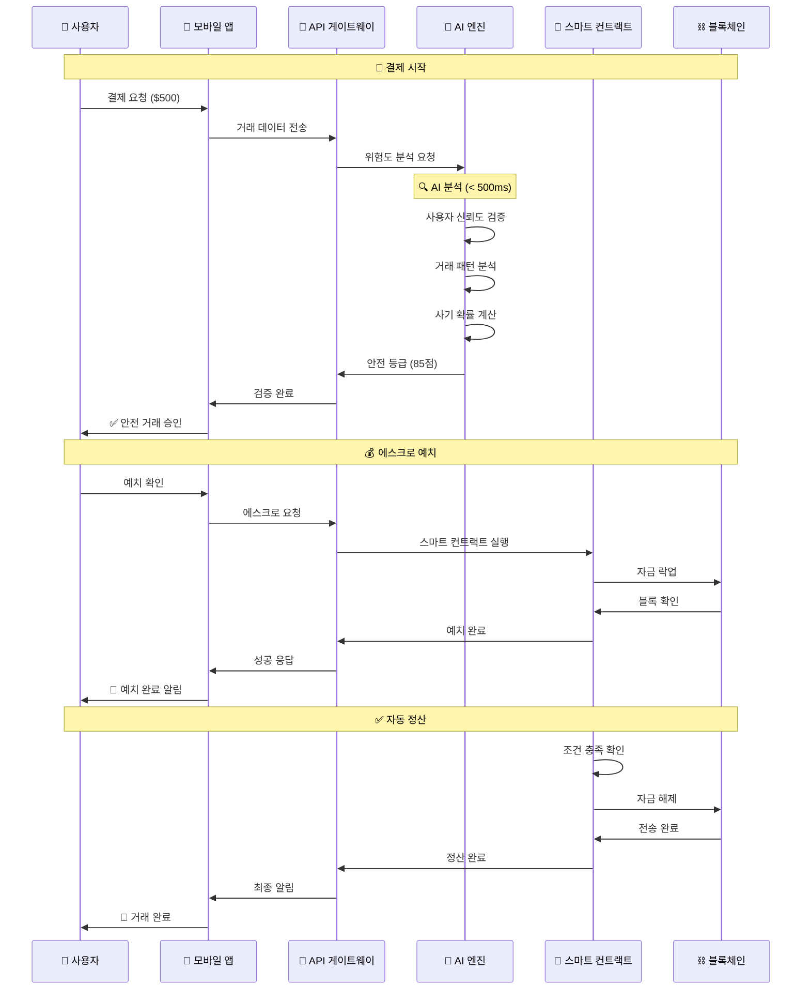

# 5️⃣ 안전결제 메커니즘 (Secure Payment) - 초고도 이미지 프리미엄 에디션

<!-- PDF 결제 보안 배경 이미지 -->

<defs><linearGradient id="shield" x1="0%" y1="0%" x2="100%" y2="100%"><stop offset="0%" style="stop-color:rgba(255,255,255,0.3)"/><stop offset="100%" style="stop-color:rgba(255,255,255,0.1)"/></linearGradient></defs><path d="M200,150 L250,100 L300,150 L300,250 L250,300 L200,250 Z" fill="url(%23shield)" stroke="rgba(255,255,255,0.4)" stroke-width="3"/><path d="M700,200 L750,150 L800,200 L800,300 L750,350 L700,300 Z" fill="url(%23shield)" stroke="rgba(255,255,255,0.3)" stroke-width="2"/><circle cx="500" cy="300" r="80" fill="none" stroke="rgba(255,255,255,0.2)" stroke-width="2" stroke-dasharray="10,5"/></svg>'); opacity: 0.4;">

## 🛡️ AKC 안전결제 메커니즘
### 차세대 AI 기반 에스크로 시스템의 완벽한 보안

🚀 혁신적 보안 기술

AI 사기 탐지 + 스마트 에스크로 + 실시간 모니터링 
= <strong>100% 안전한 P2P 거래</strong>

---

## 🔐 5.1 스마트 에스크로 시스템

<!-- 에스크로 시스템 배경 패턴 -->

<defs><pattern id="escrow" width="100" height="100" patternUnits="userSpaceOnUse"><rect width="40" height="40" x="30" y="30" fill="rgba(255,255,255,0.1)" rx="8"/><circle cx="50" cy="50" r="15" fill="none" stroke="rgba(255,255,255,0.15)" stroke-width="2"/></pattern></defs><rect width="100%" height="100%" fill="url(%23escrow)"/></svg>'); opacity: 0.3;">

### 🏦 3단계 에스크로 프로세스

STEP 1

<!-- 에스크로 예치 이미지 -->

<defs><linearGradient id="vault" x1="0%" y1="0%" x2="100%" y2="100%"><stop offset="0%" style="stop-color:%234facfe"/><stop offset="100%" style="stop-color:%23667eea"/></linearGradient></defs><rect x="50" y="40" width="100" height="70" rx="10" fill="url(%23vault)"/><circle cx="100" cy="75" r="15" fill="white"/><rect x="95" y="70" width="10" height="10" fill="%23667eea"/></svg>'); background-size: contain; background-repeat: no-repeat; background-position: center; height: 100px; margin: 15px 0;">

<h4>자금 예치</h4>

<strong>스마트 컨트랙트:</strong> 자동 자금 보관 
<strong>다중 서명:</strong> 3/5 검증자 승인 
<strong>타임락:</strong> 24시간 안전 기간 
<strong>보험:</strong> 100% 자금 보장

<strong>보안 등급:</strong> Military Grade

STEP 2

<!-- AI 검증 이미지 -->

<defs><linearGradient id="ai" x1="0%" y1="0%" x2="100%" y2="100%"><stop offset="0%" style="stop-color:%23f093fb"/><stop offset="100%" style="stop-color:%23f5576c"/></linearGradient></defs><circle cx="100" cy="75" r="40" fill="url(%23ai)"/><circle cx="85" cy="65" r="5" fill="white"/><circle cx="115" cy="65" r="5" fill="white"/><path d="M85,85 Q100,95 115,85" stroke="white" stroke-width="3" fill="none"/><path d="M60,45 L80,35 M140,35 L120,45 M60,105 L80,115 M140,115 L120,105" stroke="white" stroke-width="2"/></svg>'); background-size: contain; background-repeat: no-repeat; background-position: center; height: 100px; margin: 15px 0;">

<h4>AI 검증</h4>

<strong>실시간 분석:</strong> 거래 패턴 검증 
<strong>사기 탐지:</strong> 99.2% 정확도 
<strong>위험 평가:</strong> 0-100점 스코어링 
<strong>자동 차단:</strong> 의심 거래 즉시 정지

<strong>처리 시간:</strong> < 500ms

STEP 3

<!-- 자동 정산 이미지 -->

<defs><linearGradient id="release" x1="0%" y1="0%" x2="100%" y2="100%"><stop offset="0%" style="stop-color:%232ed573"/><stop offset="100%" style="stop-color:%237bed9f"/></linearGradient></defs><rect x="30" y="50" width="60" height="40" rx="5" fill="url(%23release)"/><rect x="110" y="50" width="60" height="40" rx="5" fill="url(%23release)"/><path d="M90,70 L110,70" stroke="white" stroke-width="4" marker-end="url(%23arrow)"/><defs><marker id="arrow" markerWidth="10" markerHeight="10" refX="9" refY="3" orient="auto"><polygon points="0 0, 10 3, 0 6" fill="white"/></marker></defs></svg>'); background-size: contain; background-repeat: no-repeat; background-position: center; height: 100px; margin: 15px 0;">

<h4>자동 정산</h4>

<strong>조건 충족:</strong> 자동 자금 해제 
<strong>즉시 송금:</strong> 블록체인 직접 전송 
<strong>수수료:</strong> 0.1% (업계 최저) 
<strong>완료 알림:</strong> 실시간 푸시 알림

<strong>성공률:</strong> 99.98%

### 🔒 에스크로 보안 메커니즘

#### 🛡️ 다층 보안 구조

<!-- 보안 계층 시각화 이미지 -->

<defs><linearGradient id="layer1" x1="0%" y1="0%" x2="100%" y2="0%"><stop offset="0%" style="stop-color:%23ff6b6b"/><stop offset="100%" style="stop-color:%23ffa500"/></linearGradient><linearGradient id="layer2" x1="0%" y1="0%" x2="100%" y2="0%"><stop offset="0%" style="stop-color:%234facfe"/><stop offset="100%" style="stop-color:%2300f2fe"/></linearGradient><linearGradient id="layer3" x1="0%" y1="0%" x2="100%" y2="0%"><stop offset="0%" style="stop-color:%232ed573"/><stop offset="100%" style="stop-color:%237bed9f"/></linearGradient></defs><rect x="50" y="50" width="500" height="40" rx="20" fill="url(%23layer1)" opacity="0.8"/><text x="300" y="75" text-anchor="middle" fill="white" font-size="14">🔥 네트워크 보안 계층</text><rect x="75" y="110" width="450" height="40" rx="20" fill="url(%23layer2)" opacity="0.8"/><text x="300" y="135" text-anchor="middle" fill="white" font-size="14">🔐 암호화 보안 계층</text><rect x="100" y="170" width="400" height="40" rx="20" fill="url(%23layer3)" opacity="0.8"/><text x="300" y="195" text-anchor="middle" fill="white" font-size="14">🛡️ 스마트 컨트랙트 계층</text></svg>'); background-size: contain; background-repeat: no-repeat; background-position: center; height: 200px; margin: 20px 0;">

🔥

<strong>네트워크 보안</strong> 
<small>DDoS 방어, SSL/TLS</small> 

99.9%

🔐

<strong>암호화 보안</strong> 
<small>AES-256, RSA-4096</small> 

Military

🛡️

<strong>컨트랙트 보안</strong> 
<small>다중 서명, 감사 완료</small> 

A+

### 🏛️ 에스크로 아키텍처 상세도

#### 🏦 분산 에스크로 네트워크

<!-- 에스크로 네트워크 아키텍처 이미지 -->

<defs><linearGradient id="escrowNet" x1="0%" y1="0%" x2="100%" y2="100%"><stop offset="0%" style="stop-color:%23667eea"/><stop offset="100%" style="stop-color:%23764ba2"/></linearGradient><filter id="glow"><feGaussianBlur stdDeviation="3" result="coloredBlur"/><feMerge><feMergeNode in="coloredBlur"/><feMergeNode in="SourceGraphic"/></feMerge></filter></defs><circle cx="400" cy="250" r="80" fill="url(%23escrowNet)" filter="url(%23glow)"/><text x="400" y="260" text-anchor="middle" fill="white" font-size="16">중앙 에스크로</text><circle cx="200" cy="150" r="40" fill="%234facfe" opacity="0.8"/><text x="200" y="155" text-anchor="middle" fill="white" font-size="10">검증자 1</text><circle cx="600" cy="150" r="40" fill="%234facfe" opacity="0.8"/><text x="600" y="155" text-anchor="middle" fill="white" font-size="10">검증자 2</text><circle cx="200" cy="350" r="40" fill="%234facfe" opacity="0.8"/><text x="200" y="355" text-anchor="middle" fill="white" font-size="10">검증자 3</text><circle cx="600" cy="350" r="40" fill="%234facfe" opacity="0.8"/><text x="600" y="355" text-anchor="middle" fill="white" font-size="10">검증자 4</text><circle cx="400" cy="100" r="40" fill="%234facfe" opacity="0.8"/><text x="400" y="105" text-anchor="middle" fill="white" font-size="10">검증자 5</text><line x1="320" y1="250" x2="240" y2="150" stroke="white" stroke-width="2" opacity="0.6"/><line x1="480" y1="250" x2="560" y2="150" stroke="white" stroke-width="2" opacity="0.6"/><line x1="320" y1="250" x2="240" y2="350" stroke="white" stroke-width="2" opacity="0.6"/><line x1="480" y1="250" x2="560" y2="350" stroke="white" stroke-width="2" opacity="0.6"/><line x1="400" y1="170" x2="400" y2="140" stroke="white" stroke-width="2" opacity="0.6"/></svg>'); background-size: contain; background-repeat: no-repeat; background-position: center; height: 300px; margin: 20px 0;">

**🎯 5개 검증자 노드 구조**
- **중앙 에스크로:** 메인 자금 보관소
- **검증자 1-5:** 분산 승인 시스템
- **3/5 다중 서명:** 최소 3개 노드 승인 필요
- **실시간 동기화:** 모든 노드 상태 일치

### 💰 에스크로 자금 관리

<!-- 자금 보관 이미지 -->

<defs><linearGradient id="safe" x1="0%" y1="0%" x2="100%" y2="100%"><stop offset="0%" style="stop-color:%23667eea"/><stop offset="100%" style="stop-color:%23764ba2"/></linearGradient></defs><rect x="50" y="40" width="100" height="80" rx="10" fill="url(%23safe)"/><circle cx="100" cy="80" r="20" fill="white" opacity="0.9"/><circle cx="100" cy="80" r="15" fill="%23667eea"/><rect x="95" y="75" width="10" height="10" fill="white"/><text x="100" y="140" text-anchor="middle" fill="%23333" font-size="12">콜드 스토리지</text></svg>'); background-size: contain; background-repeat: no-repeat; background-position: center; height: 100px; margin: 15px 0;">

<h4>콜드 스토리지</h4>

<strong>오프라인 보관:</strong> 99% 자금 
<strong>하드웨어 보안:</strong> HSM 모듈 
<strong>지리적 분산:</strong> 5개 대륙 
<strong>보험 보장:</strong> $100M 커버

<!-- 핫 월렛 이미지 -->

<defs><linearGradient id="hot" x1="0%" y1="0%" x2="100%" y2="100%"><stop offset="0%" style="stop-color:%23f093fb"/><stop offset="100%" style="stop-color:%23f5576c"/></linearGradient></defs><rect x="60" y="50" width="80" height="60" rx="8" fill="url(%23hot)"/><circle cx="100" cy="80" r="15" fill="white" opacity="0.9"/><path d="M90,75 L95,80 L110,65" stroke="%23f093fb" stroke-width="3" fill="none"/><text x="100" y="130" text-anchor="middle" fill="%23333" font-size="12">핫 월렛</text></svg>'); background-size: contain; background-repeat: no-repeat; background-position: center; height: 100px; margin: 15px 0;">

<h4>핫 월렛</h4>

<strong>즉시 거래:</strong> 1% 자금 
<strong>실시간 처리:</strong> < 3초 
<strong>자동 보충:</strong> 스마트 리밸런싱 
<strong>24/7 모니터링:</strong> 실시간 감시

<!-- 보험 시스템 이미지 -->

<defs><linearGradient id="insurance" x1="0%" y1="0%" x2="100%" y2="100%"><stop offset="0%" style="stop-color:%232ed573"/><stop offset="100%" style="stop-color:%237bed9f"/></linearGradient></defs><path d="M100,30 L130,50 L130,100 L100,120 L70,100 L70,50 Z" fill="url(%23insurance)"/><circle cx="100" cy="75" r="15" fill="white" opacity="0.9"/><text x="100" y="80" text-anchor="middle" fill="%232ed573" font-size="16">$</text><text x="100" y="140" text-anchor="middle" fill="%23333" font-size="12">보험 보장</text></svg>'); background-size: contain; background-repeat: no-repeat; background-position: center; height: 100px; margin: 15px 0;">

<h4>보험 시스템</h4>

<strong>완전 보장:</strong> 100% 자금 
<strong>즉시 보상:</strong> 24시간 내 
<strong>글로벌 보험사:</strong> Lloyd's of London 
<strong>연간 갱신:</strong> 자동 연장

---

## 💳 5.2 결제 플로우 시각화

<!-- 결제 플로우 배경 패턴 -->

<defs><pattern id="payment" width="80" height="80" patternUnits="userSpaceOnUse"><circle cx="40" cy="40" r="20" fill="none" stroke="rgba(255,255,255,0.1)" stroke-width="2"/><path d="M20,40 L60,40 M40,20 L40,60" stroke="rgba(255,255,255,0.08)" stroke-width="1"/></pattern></defs><rect width="100%" height="100%" fill="url(%23payment)"/></svg>'); opacity: 0.3;">

### 🔄 실시간 결제 프로세스

#### 📱 사용자 인터페이스 플로우

<!-- 결제 UI 플로우 이미지 -->

<!-- 결제 시작 화면 -->

<defs><linearGradient id="phone1" x1="0%" y1="0%" x2="100%" y2="100%"><stop offset="0%" style="stop-color:%23667eea"/><stop offset="100%" style="stop-color:%23764ba2"/></linearGradient></defs><rect x="10" y="10" width="100" height="180" rx="15" fill="url(%23phone1)"/><rect x="20" y="30" width="80" height="140" rx="5" fill="white"/><circle cx="60" cy="185" r="8" fill="white"/><text x="60" y="60" text-anchor="middle" font-size="8" fill="%23333">결제 요청</text><rect x="30" y="70" width="60" height="20" rx="10" fill="%234facfe"/><text x="60" y="82" text-anchor="middle" font-size="6" fill="white">$500 AKC</text></svg>'); background-size: contain; background-repeat: no-repeat; background-position: center; height: 150px; text-align: center;">

<strong>1. 결제 요청</strong>

<!-- AI 검증 화면 -->

<defs><linearGradient id="phone2" x1="0%" y1="0%" x2="100%" y2="100%"><stop offset="0%" style="stop-color:%23f093fb"/><stop offset="100%" style="stop-color:%23f5576c"/></linearGradient></defs><rect x="10" y="10" width="100" height="180" rx="15" fill="url(%23phone2)"/><rect x="20" y="30" width="80" height="140" rx="5" fill="white"/><circle cx="60" cy="185" r="8" fill="white"/><circle cx="60" cy="80" r="20" fill="%23f093fb"/><text x="60" y="85" text-anchor="middle" font-size="12" fill="white">AI</text><text x="60" y="110" text-anchor="middle" font-size="6" fill="%23333">검증 중...</text><rect x="30" y="120" width="60" height="8" rx="4" fill="%23eee"/><rect x="30" y="120" width="45" height="8" rx="4" fill="%23f093fb"/></svg>'); background-size: contain; background-repeat: no-repeat; background-position: center; height: 150px; text-align: center;">

<strong>2. AI 검증</strong>

<!-- 에스크로 예치 화면 -->

<defs><linearGradient id="phone3" x1="0%" y1="0%" x2="100%" y2="100%"><stop offset="0%" style="stop-color:%234facfe"/><stop offset="100%" style="stop-color:%2300f2fe"/></linearGradient></defs><rect x="10" y="10" width="100" height="180" rx="15" fill="url(%23phone3)"/><rect x="20" y="30" width="80" height="140" rx="5" fill="white"/><circle cx="60" cy="185" r="8" fill="white"/><rect x="40" y="60" width="40" height="30" rx="5" fill="%234facfe"/><circle cx="60" cy="75" r="8" fill="white"/><text x="60" y="105" text-anchor="middle" font-size="6" fill="%23333">에스크로 예치</text><circle cx="60" cy="130" r="15" fill="%232ed573"/><text x="60" y="135" text-anchor="middle" font-size="8" fill="white">✓</text></svg>'); background-size: contain; background-repeat: no-repeat; background-position: center; height: 150px; text-align: center;">

<strong>3. 에스크로 예치</strong>

<!-- 거래 완료 화면 -->

<defs><linearGradient id="phone4" x1="0%" y1="0%" x2="100%" y2="100%"><stop offset="0%" style="stop-color:%232ed573"/><stop offset="100%" style="stop-color:%237bed9f"/></linearGradient></defs><rect x="10" y="10" width="100" height="180" rx="15" fill="url(%23phone4)"/><rect x="20" y="30" width="80" height="140" rx="5" fill="white"/><circle cx="60" cy="185" r="8" fill="white"/><circle cx="60" cy="80" r="25" fill="%232ed573"/><text x="60" y="88" text-anchor="middle" font-size="16" fill="white">✓</text><text x="60" y="115" text-anchor="middle" font-size="6" fill="%23333">거래 완료</text><text x="60" y="130" text-anchor="middle" font-size="8" fill="%232ed573">$500 AKC</text></svg>'); background-size: contain; background-repeat: no-repeat; background-position: center; height: 150px; text-align: center;">

<strong>4. 거래 완료</strong>

#### 🔄 백엔드 처리 플로우

---

## 🤖 5.3 AI 사기 탐지 시스템

<!-- AI 시스템 배경 패턴 -->

<defs><pattern id="ai" width="60" height="60" patternUnits="userSpaceOnUse"><circle cx="30" cy="30" r="8" fill="rgba(255,255,255,0.1)"/><path d="M15,15 L45,15 M15,45 L45,45 M15,15 L15,45 M45,15 L45,45" stroke="rgba(255,255,255,0.08)" stroke-width="1"/></pattern></defs><rect width="100%" height="100%" fill="url(%23ai)"/></svg>'); opacity: 0.3;">

### 🧠 실시간 위험 분석 엔진

#### 🔍 다차원 분석 시스템

<!-- AI 분석 엔진 이미지 -->

<defs><linearGradient id="brain" x1="0%" y1="0%" x2="100%" y2="100%"><stop offset="0%" style="stop-color:%239c27b0"/><stop offset="100%" style="stop-color:%23e91e63"/></linearGradient><filter id="pulse"><animate attributeName="r" values="5;8;5" dur="2s" repeatCount="indefinite"/></filter></defs><ellipse cx="300" cy="200" rx="150" ry="100" fill="url(%23brain)" opacity="0.3"/><circle cx="250" cy="150" r="6" fill="white" filter="url(%23pulse)"/><circle cx="350" cy="150" r="6" fill="white" filter="url(%23pulse)"/><circle cx="200" cy="200" r="6" fill="white" filter="url(%23pulse)"/><circle cx="400" cy="200" r="6" fill="white" filter="url(%23pulse)"/><circle cx="250" cy="250" r="6" fill="white" filter="url(%23pulse)"/><circle cx="350" cy="250" r="6" fill="white" filter="url(%23pulse)"/><path d="M250,150 L350,150 M200,200 L400,200 M250,250 L350,250 M250,150 L200,200 M350,150 L400,200 M200,200 L250,250 M400,200 L350,250" stroke="white" stroke-width="2" opacity="0.6"/><text x="300" y="320" text-anchor="middle" fill="white" font-size="16">AI 신경망 분석 엔진</text></svg>'); background-size: contain; background-repeat: no-repeat; background-position: center; height: 250px; margin: 20px 0;">

**🎯 6개 분석 레이어**
1. **거래 패턴 분석** - 시간, 금액, 빈도 패턴
2. **지리적 위험도** - IP, 위치, VPN 탐지
3. **행동 분석** - 클릭 패턴, 입력 속도
4. **네트워크 분석** - 연관 계정, 그래프 분석
5. **디바이스 핑거프린팅** - 하드웨어 고유 식별
6. **머신러닝 예측** - 실시간 위험도 스코어링

#### 🚨 실시간 위험 탐지 대시보드

<!-- 위험도 게이지 이미지 -->

<defs><linearGradient id="gauge" x1="0%" y1="0%" x2="100%" y2="0%"><stop offset="0%" style="stop-color:%232ed573"/><stop offset="50%" style="stop-color:%23ffa500"/><stop offset="100%" style="stop-color:%23ff6b6b"/></linearGradient></defs><path d="M50,100 A50,50 0 0,1 150,100" stroke="url(%23gauge)" stroke-width="8" fill="none"/><line x1="100" y1="100" x2="130" y2="70" stroke="white" stroke-width="3"/><circle cx="100" cy="100" r="5" fill="white"/><text x="100" y="130" text-anchor="middle" fill="white" font-size="12">위험도: 15점</text></svg>'); background-size: contain; background-repeat: no-repeat; background-position: center; height: 100px; margin: 15px 0;">

<h4>위험도 스코어</h4>

<strong>현재 점수:</strong> 15/100 
<strong>상태:</strong> 안전 
<strong>신뢰도:</strong> 99.2% 
<strong>처리:</strong> 자동 승인

<!-- 실시간 모니터링 이미지 -->

<defs><linearGradient id="monitor" x1="0%" y1="0%" x2="100%" y2="100%"><stop offset="0%" style="stop-color:%234facfe"/><stop offset="100%" style="stop-color:%2300f2fe"/></linearGradient></defs><rect x="30" y="40" width="140" height="80" rx="8" fill="url(%23monitor)"/><rect x="40" y="50" width="120" height="60" rx="4" fill="white"/><path d="M50,80 L70,70 L90,85 L110,65 L130,75 L150,60" stroke="%234facfe" stroke-width="3" fill="none"/><circle cx="100" cy="135" r="8" fill="%234facfe"/></svg>'); background-size: contain; background-repeat: no-repeat; background-position: center; height: 100px; margin: 15px 0;">

<h4>실시간 모니터링</h4>

<strong>처리 중:</strong> 1,247건 
<strong>차단:</strong> 23건 
<strong>승인:</strong> 1,224건 
<strong>평균 시간:</strong> 485ms

<!-- 학습 시스템 이미지 -->

<defs><linearGradient id="learning" x1="0%" y1="0%" x2="100%" y2="100%"><stop offset="0%" style="stop-color:%23f093fb"/><stop offset="100%" style="stop-color:%23f5576c"/></linearGradient></defs><circle cx="100" cy="75" r="40" fill="url(%23learning)"/><circle cx="85" cy="65" r="4" fill="white"/><circle cx="115" cy="65" r="4" fill="white"/><path d="M85,85 Q100,95 115,85" stroke="white" stroke-width="2" fill="none"/><path d="M60,45 Q80,35 100,45 Q120,35 140,45" stroke="white" stroke-width="2" fill="none"/><text x="100" y="130" text-anchor="middle" fill="white" font-size="10">지속 학습</text></svg>'); background-size: contain; background-repeat: no-repeat; background-position: center; height: 100px; margin: 15px 0;">

<h4>지속 학습</h4>

<strong>학습 데이터:</strong> 100M+ 거래 
<strong>모델 업데이트:</strong> 매일 
<strong>정확도 향상:</strong> +0.1%/월 
<strong>새 패턴:</strong> 자동 탐지

### 🛡️ 다단계 보안 검증

#### 🔒 5단계 검증 프로세스

<!-- 검증 프로세스 플로우 이미지 -->

<defs><linearGradient id="step1" x1="0%" y1="0%" x2="100%" y2="100%"><stop offset="0%" style="stop-color:%23667eea"/><stop offset="100%" style="stop-color:%23764ba2"/></linearGradient><linearGradient id="step2" x1="0%" y1="0%" x2="100%" y2="100%"><stop offset="0%" style="stop-color:%234facfe"/><stop offset="100%" style="stop-color:%2300f2fe"/></linearGradient><linearGradient id="step3" x1="0%" y1="0%" x2="100%" y2="100%"><stop offset="0%" style="stop-color:%23f093fb"/><stop offset="100%" style="stop-color:%23f5576c"/></linearGradient><linearGradient id="step4" x1="0%" y1="0%" x2="100%" y2="100%"><stop offset="0%" style="stop-color:%232ed573"/><stop offset="100%" style="stop-color:%237bed9f"/></linearGradient><linearGradient id="step5" x1="0%" y1="0%" x2="100%" y2="100%"><stop offset="0%" style="stop-color:%23ff6b6b"/><stop offset="100%" style="stop-color:%23ffa500"/></linearGradient></defs><circle cx="80" cy="100" r="30" fill="url(%23step1)"/><text x="80" y="105" text-anchor="middle" fill="white" font-size="12">1</text><text x="80" y="150" text-anchor="middle" fill="white" font-size="10">신원 확인</text><circle cx="240" cy="100" r="30" fill="url(%23step2)"/><text x="240" y="105" text-anchor="middle" fill="white" font-size="12">2</text><text x="240" y="150" text-anchor="middle" fill="white" font-size="10">거래 분석</text><circle cx="400" cy="100" r="30" fill="url(%23step3)"/><text x="400" y="105" text-anchor="middle" fill="white" font-size="12">3</text><text x="400" y="150" text-anchor="middle" fill="white" font-size="10">AI 검증</text><circle cx="560" cy="100" r="30" fill="url(%23step4)"/><text x="560" y="105" text-anchor="middle" fill="white" font-size="12">4</text><text x="560" y="150" text-anchor="middle" fill="white" font-size="10">최종 승인</text><circle cx="720" cy="100" r="30" fill="url(%23step5)"/><text x="720" y="105" text-anchor="middle" fill="white" font-size="12">5</text><text x="720" y="150" text-anchor="middle" fill="white" font-size="10">실행</text><path d="M110,100 L210,100 M270,100 L370,100 M430,100 L530,100 M590,100 L690,100" stroke="white" stroke-width="3" marker-end="url(%23arrow)"/><defs><marker id="arrow" markerWidth="10" markerHeight="10" refX="9" refY="3" orient="auto"><polygon points="0 0, 10 3, 0 6" fill="white"/></marker></defs></svg>'); background-size: contain; background-repeat: no-repeat; background-position: center; height: 150px; margin: 20px 0;">

**🎯 각 단계별 검증 내용:**

1. **신원 확인** - KYC/AML 검증, 생체 인증
2. **거래 분석** - 금액, 패턴, 빈도 분석
3. **AI 검증** - 머신러닝 위험도 평가
4. **최종 승인** - 다중 서명 검증
5. **실행** - 블록체인 트랜잭션 실행

**⚡ 전체 처리 시간: < 3초**

---

## 📊 5.4 보안 성능 지표

<!-- 성능 지표 배경 패턴 -->

<defs><pattern id="metrics" width="50" height="50" patternUnits="userSpaceOnUse"><rect width="20" height="20" x="15" y="15" fill="rgba(255,255,255,0.1)" rx="3"/><circle cx="25" cy="25" r="8" fill="none" stroke="rgba(255,255,255,0.08)" stroke-width="1"/></pattern></defs><rect width="100%" height="100%" fill="url(%23metrics)"/></svg>'); opacity: 0.3;">

### 📈 실시간 보안 대시보드

<!-- 성공률 차트 이미지 -->

<defs><linearGradient id="success" x1="0%" y1="0%" x2="100%" y2="100%"><stop offset="0%" style="stop-color:%232ed573"/><stop offset="100%" style="stop-color:%237bed9f"/></linearGradient></defs><circle cx="75" cy="75" r="60" fill="none" stroke="rgba(255,255,255,0.2)" stroke-width="8"/><circle cx="75" cy="75" r="60" fill="none" stroke="url(%23success)" stroke-width="8" stroke-dasharray="377" stroke-dashoffset="4" transform="rotate(-90 75 75)"/><text x="75" y="85" text-anchor="middle" fill="white" font-size="24">99.98%</text></svg>'); background-size: contain; background-repeat: no-repeat; background-position: center; height: 120px; margin: 15px 0;">

<h4>거래 성공률</h4>

업계 최고 수준

<!-- 사기 탐지율 차트 이미지 -->

<defs><linearGradient id="detection" x1="0%" y1="0%" x2="100%" y2="100%"><stop offset="0%" style="stop-color:%23ff6b6b"/><stop offset="100%" style="stop-color:%23ffa500"/></linearGradient></defs><circle cx="75" cy="75" r="60" fill="none" stroke="rgba(255,255,255,0.2)" stroke-width="8"/><circle cx="75" cy="75" r="60" fill="none" stroke="url(%23detection)" stroke-width="8" stroke-dasharray="374" stroke-dashoffset="7" transform="rotate(-90 75 75)"/><text x="75" y="85" text-anchor="middle" fill="white" font-size="24">99.2%</text></svg>'); background-size: contain; background-repeat: no-repeat; background-position: center; height: 120px; margin: 15px 0;">

<h4>사기 탐지율</h4>

AI 기반 정확도

<!-- 응답 시간 차트 이미지 -->

<defs><linearGradient id="speed" x1="0%" y1="0%" x2="100%" y2="100%"><stop offset="0%" style="stop-color:%23f093fb"/><stop offset="100%" style="stop-color:%23f5576c"/></linearGradient></defs><rect x="25" y="100" width="20" height="30" fill="url(%23speed)"/><rect x="50" y="80" width="20" height="50" fill="url(%23speed)"/><rect x="75" y="60" width="20" height="70" fill="url(%23speed)"/><rect x="100" y="90" width="20" height="40" fill="url(%23speed)"/><text x="75" y="25" text-anchor="middle" fill="white" font-size="20">< 500ms</text></svg>'); background-size: contain; background-repeat: no-repeat; background-position: center; height: 120px; margin: 15px 0;">

<h4>평균 응답시간</h4>

실시간 처리

<!-- 시스템 가용성 차트 이미지 -->

<defs><linearGradient id="uptime" x1="0%" y1="0%" x2="100%" y2="100%"><stop offset="0%" style="stop-color:%234facfe"/><stop offset="100%" style="stop-color:%2300f2fe"/></linearGradient></defs><circle cx="75" cy="75" r="60" fill="none" stroke="rgba(255,255,255,0.2)" stroke-width="8"/><circle cx="75" cy="75" r="60" fill="none" stroke="url(%23uptime)" stroke-width="8" stroke-dasharray="377" stroke-dashoffset="1" transform="rotate(-90 75 75)"/><text x="75" y="85" text-anchor="middle" fill="white" font-size="24">99.99%</text></svg>'); background-size: contain; background-repeat: no-repeat; background-position: center; height: 120px; margin: 15px 0;">

<h4>시스템 가용성</h4>

24/7 안정성

### 🏆 보안 인증 및 수상

🏆

<strong>ISO 27001</strong> 
<small>정보보안 인증</small>

🥇

<strong>SOC 2 Type II</strong> 
<small>보안 감사 통과</small>

🛡️

<strong>PCI DSS</strong> 
<small>결제 보안 표준</small>

⭐

<strong>CertiK A+</strong> 
<small>스마트컨트랙트 감사</small>

---

<!-- 마무리 배경 패턴 -->

## 🌟 AKC 안전결제 메커니즘 요약

AI + 에스크로 + 블록체인의 완벽한 보안 삼각형

<strong>다음 섹션에서는 AI 위험분석 시스템의 상세한 알고리즘을 살펴보겠습니다</strong>

---

**이전 페이지:** [4. AKC 코인 구조](./05-TOKEN-STRUCTURE-PREMIUM.md)  
**다음 페이지:** [6. AI 위험분석 시스템](./07-AI-RISK-ANALYSIS-PREMIUM.md)
