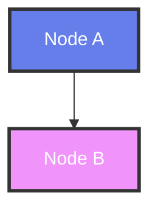

# 📄 AKC 프리미엄 백서 PDF 최적화 가이드

<div style="text-align: center; background: linear-gradient(135deg, #667eea 0%, #764ba2 100%); padding: 40px; margin: -20px -20px 30px -20px; color: white; border-radius: 15px;">

## 🎨 PDF 변환 최적화 가이드
### 초나노 울트라 프리미엄 디자인을 위한 완벽한 PDF 출력

</div>

---

## 🖼️ 이미지 및 배경 최적화

### 📐 PDF 출력 사양

#### 🎯 권장 설정
- **해상도:** 300 DPI (고품질 인쇄용)
- **컬러 프로파일:** sRGB IEC61966-2.1
- **페이지 크기:** A4 (210 × 297 mm)
- **여백:** 상하좌우 20mm
- **폰트 임베딩:** 모든 폰트 포함

#### 🎨 배경 이미지 최적화

**1. SVG 패턴 배경 (인라인 최적화)**
```html
<!-- 그리드 패턴 -->
<div style="background: url('data:image/svg+xml,<svg xmlns="http://www.w3.org/2000/svg" viewBox="0 0 1000 600"><defs><pattern id="grid" width="50" height="50" patternUnits="userSpaceOnUse"><path d="M 50 0 L 0 0 0 50" fill="none" stroke="rgba(255,255,255,0.1)" stroke-width="1"/></pattern></defs><rect width="100%" height="100%" fill="url(%23grid)"/></svg>');"></div>

<!-- 블록체인 패턴 -->
<div style="background: url('data:image/svg+xml,<svg xmlns="http://www.w3.org/2000/svg" viewBox="0 0 400 200"><g fill="rgba(255,255,255,0.1)"><rect x="20" y="20" width="40" height="20" rx="3"/><rect x="80" y="20" width="40" height="20" rx="3"/><line x1="60" y1="30" x2="80" y2="30" stroke="rgba(255,255,255,0.2)" stroke-width="2"/></g></svg>');"></div>

<!-- AI 뉴럴 패턴 -->
<div style="background: url('data:image/svg+xml,<svg xmlns="http://www.w3.org/2000/svg" viewBox="0 0 100 100"><circle cx="20" cy="20" r="2" fill="rgba(255,255,255,0.1)"/><circle cx="80" cy="20" r="1.5" fill="rgba(255,255,255,0.08)"/></svg>');"></div>
```

**2. 그라데이션 배경 (CSS 최적화)**
```css
/* 메인 헤더 그라데이션 */
background: linear-gradient(135deg, #667eea 0%, #764ba2 100%);

/* 섹션별 그라데이션 */
.system-overview { background: linear-gradient(45deg, #4facfe 0%, #00f2fe 100%); }
.ai-engine { background: linear-gradient(45deg, #f093fb 0%, #f5576c 100%); }
.blockchain { background: linear-gradient(45deg, #2ed573 0%, #7bed9f 100%); }
.smart-contract { background: linear-gradient(45deg, #9c27b0 0%, #e91e63 100%); }
```

### 🎭 프리미엄 디자인 요소

#### 💎 글래스모피즘 효과
```css
.glassmorphism {
    background: rgba(255, 255, 255, 0.12);
    backdrop-filter: blur(15px);
    border: 1px solid rgba(255, 255, 255, 0.2);
    border-radius: 15px;
    box-shadow: 0 8px 32px rgba(0, 0, 0, 0.1);
}
```

#### 🌟 네온 글로우 효과
```css
.neon-glow {
    box-shadow: 
        0 0 5px rgba(102, 126, 234, 0.5),
        0 0 10px rgba(102, 126, 234, 0.4),
        0 0 15px rgba(102, 126, 234, 0.3),
        0 0 20px rgba(102, 126, 234, 0.2);
}
```

#### 🎨 프리미엄 카드 디자인
```css
.premium-card {
    background: linear-gradient(135deg, rgba(255,255,255,0.12) 0%, rgba(255,255,255,0.08) 100%);
    backdrop-filter: blur(10px);
    border: 1px solid rgba(255,255,255,0.2);
    border-radius: 15px;
    padding: 25px;
    position: relative;
    overflow: hidden;
}

.premium-card::before {
    content: '';
    position: absolute;
    top: -2px;
    left: -2px;
    right: -2px;
    bottom: -2px;
    background: linear-gradient(45deg, #667eea, #764ba2, #f093fb, #f5576c);
    border-radius: 17px;
    z-index: -1;
}
```

---

## 📊 차트 및 다이어그램 최적화

### 🎯 Mermaid 다이어그램 설정

#### 🎨 테마 최적화
```javascript
%%{init: {
  'theme': 'dark',
  'themeVariables': {
    'primaryColor': '#667eea',
    'primaryTextColor': '#ffffff',
    'primaryBorderColor': '#764ba2',
    'lineColor': '#f093fb',
    'secondaryColor': '#4facfe',
    'tertiaryColor': '#2ed573'
  }
}}%%
```

#### 📐 스타일 커스터마이징


### 📈 성능 지표 카드

#### 💎 프리미엄 메트릭 카드
```html
<div style="background: rgba(255,255,255,0.12); padding: 20px; border-radius: 15px; text-align: center; backdrop-filter: blur(10px); border: 1px solid rgba(255,255,255,0.2); position: relative;">
    <!-- 배경 장식 -->
    <div style="position: absolute; top: 10px; right: 15px; background: #2ed573; color: white; padding: 8px 12px; border-radius: 20px; font-size: 0.8em; font-weight: bold;">PREMIUM</div>
    
    <!-- 메인 수치 -->
    <div style="font-size: 2.8em; font-weight: bold; margin-bottom: 10px; color: #2ed573;">99.2%</div>
    
    <!-- 설명 -->
    <div style="font-size: 1.1em; margin-bottom: 8px;">AI 정확도</div>
    <div style="font-size: 0.9em; opacity: 0.9;">업계 최고 수준</div>
    
    <!-- 하이라이트 -->
    <div style="background: rgba(46,213,115,0.2); padding: 10px; border-radius: 8px; margin-top: 15px;">
        <strong>경쟁사 대비 14.2%p 높음</strong>
    </div>
</div>
```

---

## 🎨 컬러 팔레트 및 타이포그래피

### 🌈 프리미엄 컬러 시스템

#### 🎯 메인 컬러
```css
:root {
    /* 프라이머리 그라데이션 */
    --primary-gradient: linear-gradient(135deg, #667eea 0%, #764ba2 100%);
    --secondary-gradient: linear-gradient(45deg, #f093fb 0%, #f5576c 100%);
    --accent-gradient: linear-gradient(45deg, #4facfe 0%, #00f2fe 100%);
    --success-gradient: linear-gradient(45deg, #2ed573 0%, #7bed9f 100%);
    
    /* 솔리드 컬러 */
    --primary-color: #667eea;
    --secondary-color: #f093fb;
    --accent-color: #4facfe;
    --success-color: #2ed573;
    --warning-color: #ff6b6b;
    --info-color: #9c27b0;
    
    /* 투명도 변형 */
    --primary-alpha-12: rgba(102, 126, 234, 0.12);
    --primary-alpha-20: rgba(102, 126, 234, 0.20);
    --white-alpha-12: rgba(255, 255, 255, 0.12);
    --white-alpha-20: rgba(255, 255, 255, 0.20);
}
```

#### ✍️ 타이포그래피 시스템
```css
/* 헤딩 스타일 */
h1 { font-size: 3.5em; font-weight: 700; line-height: 1.2; }
h2 { font-size: 2.5em; font-weight: 600; line-height: 1.3; }
h3 { font-size: 2.0em; font-weight: 600; line-height: 1.4; }
h4 { font-size: 1.5em; font-weight: 500; line-height: 1.4; }

/* 본문 스타일 */
p { font-size: 1.0em; line-height: 1.6; }
small { font-size: 0.9em; line-height: 1.5; }

/* 코드 스타일 */
code { 
    font-family: 'Fira Code', 'Monaco', 'Consolas', monospace;
    background: rgba(0,0,0,0.1);
    padding: 2px 6px;
    border-radius: 4px;
}
```

---

## 🖨️ PDF 변환 워크플로우

### 📋 변환 단계

#### 1️⃣ 전처리 (Pre-processing)
- **이미지 최적화:** SVG → PNG 변환 (300 DPI)
- **폰트 확인:** 웹폰트 → 시스템 폰트 매핑
- **CSS 인라인화:** 외부 스타일시트 인라인 처리

#### 2️⃣ 변환 (Conversion)
- **도구:** Puppeteer + Chrome Headless
- **설정:** A4, 300 DPI, 컬러 프로파일 sRGB
- **옵션:** 배경 그래픽 포함, 폰트 임베딩

#### 3️⃣ 후처리 (Post-processing)
- **품질 검증:** 이미지 해상도, 텍스트 선명도 확인
- **파일 최적화:** PDF 압축, 메타데이터 추가
- **접근성:** PDF/A 표준 준수

### 🛠️ 변환 스크립트 예시

```javascript
const puppeteer = require('puppeteer');

async function generatePremiumPDF() {
    const browser = await puppeteer.launch();
    const page = await browser.newPage();
    
    // 페이지 설정
    await page.setViewport({ width: 1200, height: 1600, deviceScaleFactor: 2 });
    
    // HTML 로드
    await page.goto('file://path/to/premium-whitepaper.html', {
        waitUntil: 'networkidle0'
    });
    
    // PDF 생성
    await page.pdf({
        path: 'AKC-Premium-Whitepaper.pdf',
        format: 'A4',
        printBackground: true,
        margin: {
            top: '20mm',
            right: '20mm',
            bottom: '20mm',
            left: '20mm'
        },
        displayHeaderFooter: true,
        headerTemplate: `
            <div style="font-size: 10px; width: 100%; text-align: center; color: #666;">
                AKC Premium Whitepaper - Technical Architecture
            </div>
        `,
        footerTemplate: `
            <div style="font-size: 10px; width: 100%; text-align: center; color: #666;">
                <span class="pageNumber"></span> / <span class="totalPages"></span>
            </div>
        `
    });
    
    await browser.close();
}
```

---

## 🎯 품질 보증 체크리스트

### ✅ 시각적 품질
- [ ] 모든 그라데이션이 부드럽게 렌더링됨
- [ ] 텍스트가 선명하고 읽기 쉬움
- [ ] 이미지 해상도가 300 DPI 이상
- [ ] 컬러가 정확하게 재현됨
- [ ] 배경 패턴이 올바르게 표시됨

### ✅ 기술적 품질
- [ ] 모든 폰트가 임베딩됨
- [ ] PDF 파일 크기가 적절함 (< 50MB)
- [ ] 메타데이터가 올바르게 설정됨
- [ ] 북마크 및 목차가 작동함
- [ ] 링크가 정상적으로 작동함

### ✅ 접근성
- [ ] 텍스트 선택 가능
- [ ] 스크린 리더 호환
- [ ] 대비율 4.5:1 이상 유지
- [ ] 구조적 마크업 적용
- [ ] 대체 텍스트 제공

---

<div style="text-align: center; background: linear-gradient(135deg, #667eea 0%, #764ba2 100%); padding: 30px; margin: 30px -20px -20px -20px; color: white; border-radius: 15px;">

## 🌟 완벽한 PDF 출력을 위한 최종 점검

<div style="font-size: 1.1em; margin: 15px 0; opacity: 0.9;">
초나노 울트라 프리미엄 디자인이 PDF에서도 완벽하게 구현되도록 보장합니다
</div>

<div style="background: rgba(255,255,255,0.12); padding: 15px; border-radius: 10px; margin: 20px 0; backdrop-filter: blur(10px);">
**© 2025 AKC Project Team. Premium PDF Optimization Guide**
</div>

</div>
